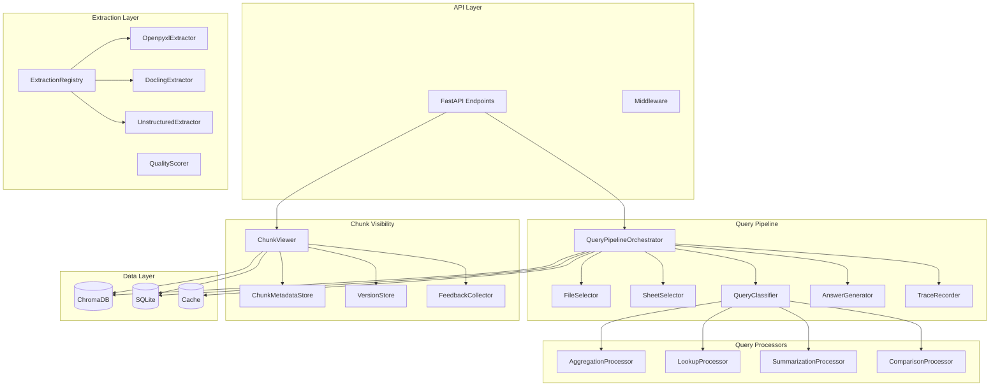
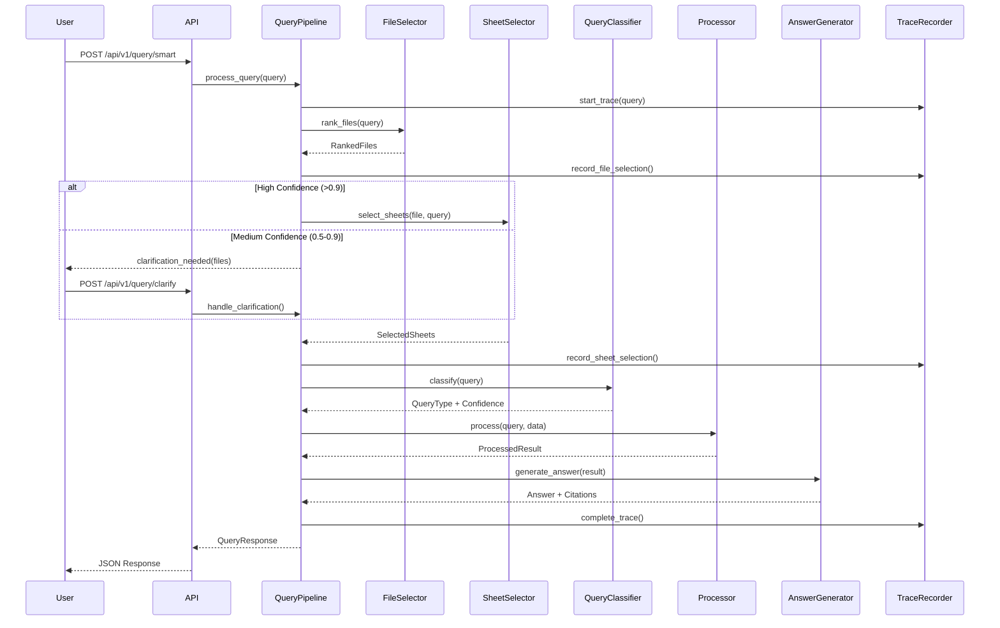

# Design Document: Excel Query Pipeline

## Overview

This design document describes the architecture and implementation for the Chunk Visibility & Smart Excel Query Pipeline feature. The system provides two major capabilities:

1. **Chunk Visibility/Debugging** - A comprehensive debugging interface for inspecting chunks generated during indexing, understanding extraction strategies, and tracking data lineage.

2. **Smart Excel Query Pipeline** - An intelligent query processing system that handles file selection, sheet selection, query classification, and answer generation with full traceability and enterprise-grade features.

### Design Goals

- **Enterprise Traceability**: Complete audit trail from query to answer with data lineage tracking
- **Extensibility**: Registry-based patterns for adding new extraction strategies and query processors
- **Testability**: All dependencies injectable, no module-level state
- **Performance**: Sub-second responses for file/sheet selection, efficient handling of large files
- **Local-First**: Fully operational on Mac Pro with Ollama, BGE-M3, and ChromaDB

### Technical Stack

| Component | Technology | Notes |
|-----------|------------|-------|
| Embeddings | BGE-M3 | In-process, multilingual |
| Vector DB | ChromaDB | In-process, persistent |
| LLM | Ollama | Separate service, local |
| Extraction | openpyxl, docling, unstructured | Open-source, no API keys |
| Database | SQLite | Metadata and traceability |
| Cache | Memory/Redis | Configurable backend |

## Architecture

### High-Level Architecture



### Component Interaction Flow



## Components and Interfaces

### 1. Query Pipeline Orchestrator

The central coordinator for query processing, implementing the smart query pipeline.

```python
from abc import ABC, abstractmethod
from typing import Protocol, Optional
from dataclasses import dataclass
from enum import Enum

class QueryType(str, Enum):
    """Classification of query types."""
    AGGREGATION = "aggregation"
    LOOKUP = "lookup"
    SUMMARIZATION = "summarization"
    COMPARISON = "comparison"

@dataclass
class QueryClassification:
    """Result of query classification."""
    query_type: QueryType
    confidence: float
    alternative_types: list[tuple[QueryType, float]]
    detected_aggregations: list[str]  # SUM, AVG, etc.
    detected_filters: list[str]
    detected_columns: list[str]

class QueryProcessorProtocol(Protocol):
    """Protocol for query processors."""
    
    def can_process(self, classification: QueryClassification) -> bool:
        """Check if this processor can handle the query type."""
        ...
    
    def process(
        self,
        query: str,
        data: "RetrievedData",
        classification: QueryClassification
    ) -> "ProcessedResult":
        """Process the query and return results."""
        ...

class QueryPipelineOrchestrator:
    """
    Orchestrates the smart query pipeline.
    
    Coordinates file selection, sheet selection, query classification,
    processing, and answer generation with full traceability.
    """
    
    def __init__(
        self,
        file_selector: "FileSelector",
        sheet_selector: "SheetSelector",
        query_classifier: "QueryClassifier",
        processor_registry: "QueryProcessorRegistry",
        answer_generator: "AnswerGenerator",
        trace_recorder: "TraceRecorder",
        cache_service: "CacheService",
        config: "QueryPipelineConfig"
    ) -> None:
        """Initialize with all dependencies injected."""
        ...
    
    def process_query(
        self,
        query: str,
        session_id: Optional[str] = None,
        file_hints: Optional[list[str]] = None,
        sheet_hints: Optional[list[str]] = None
    ) -> "QueryResponse":
        """
        Process a natural language query through the full pipeline.
        
        Returns QueryResponse with answer, citations, confidence, and trace_id.
        """
        ...
    
    def handle_clarification(
        self,
        session_id: str,
        clarification_type: str,
        selected_value: str
    ) -> "QueryResponse":
        """Handle user response to clarification request."""
        ...
```

### 2. Query Classifier

Determines the type of query and extracts relevant parameters.

```python
class QueryClassifier:
    """
    Classifies queries into types: aggregation, lookup, summarization, comparison.
    
    Uses pattern matching and LLM for ambiguous cases.
    """
    
    AGGREGATION_KEYWORDS = {
        "sum", "total", "average", "avg", "count", "min", "max",
        "median", "mean", "aggregate", "calculate"
    }
    
    LOOKUP_KEYWORDS = {
        "what is", "find", "show", "get", "value of", "look up",
        "retrieve", "fetch", "display"
    }
    
    SUMMARIZATION_KEYWORDS = {
        "summarize", "describe", "overview", "explain", "tell me about",
        "what does", "analyze", "insight"
    }
    
    COMPARISON_KEYWORDS = {
        "compare", "difference", "versus", "vs", "change between",
        "growth", "trend", "increase", "decrease"
    }
    
    def __init__(
        self,
        llm_service: "LLMService",
        embedding_service: "EmbeddingService",
        config: "ClassifierConfig"
    ) -> None:
        ...
    
    def classify(self, query: str) -> QueryClassification:
        """
        Classify the query and extract parameters.
        
        Returns classification with confidence. If confidence < 0.6,
        includes top 2 alternative classifications.
        """
        ...
```

### 3. Query Processors

Registry-based processors for each query type.

```python
class QueryProcessorRegistry:
    """
    Registry for query processors following Open/Closed Principle.
    
    New processors can be registered without modifying existing code.
    """
    
    _processors: dict[QueryType, type["BaseQueryProcessor"]] = {}
    
    @classmethod
    def register(cls, query_type: QueryType):
        """Decorator to register a processor for a query type."""
        def decorator(processor_class: type["BaseQueryProcessor"]):
            cls._processors[query_type] = processor_class
            return processor_class
        return decorator
    
    @classmethod
    def get_processor(
        cls,
        query_type: QueryType,
        **dependencies
    ) -> "BaseQueryProcessor":
        """Get processor instance for query type."""
        ...

class BaseQueryProcessor(ABC):
    """Base class for all query processors."""
    
    @abstractmethod
    def process(
        self,
        query: str,
        data: "RetrievedData",
        classification: QueryClassification
    ) -> "ProcessedResult":
        """Process query and return results."""
        ...

@QueryProcessorRegistry.register(QueryType.AGGREGATION)
class AggregationProcessor(BaseQueryProcessor):
    """
    Processes aggregation queries (SUM, AVG, COUNT, MIN, MAX, MEDIAN).
    
    Validates numeric data types and applies filters before aggregation.
    """
    
    SUPPORTED_FUNCTIONS = {"SUM", "AVERAGE", "COUNT", "MIN", "MAX", "MEDIAN"}
    
    def process(
        self,
        query: str,
        data: "RetrievedData",
        classification: QueryClassification
    ) -> "ProcessedResult":
        """
        Execute aggregation with filter support.
        
        Returns computed value, rows processed, rows skipped, and warnings.
        """
        ...

@QueryProcessorRegistry.register(QueryType.LOOKUP)
class LookupProcessor(BaseQueryProcessor):
    """Processes lookup queries for specific values."""
    ...

@QueryProcessorRegistry.register(QueryType.SUMMARIZATION)
class SummarizationProcessor(BaseQueryProcessor):
    """Generates natural language summaries of data."""
    ...

@QueryProcessorRegistry.register(QueryType.COMPARISON)
class ComparisonProcessor(BaseQueryProcessor):
    """Compares data across files, sheets, or time periods."""
    ...
```

### 4. Chunk Viewer

Provides visibility into indexed chunks for debugging.

```python
@dataclass
class ChunkDetails:
    """Complete chunk information for debugging."""
    chunk_id: str
    file_id: str
    file_name: str
    sheet_name: str
    chunk_index: int
    chunk_text: str
    raw_source_data: str
    start_row: int
    end_row: int
    overlap_rows: int
    extraction_strategy: str
    content_type: str
    row_count: int
    column_count: int
    embedding_dimensions: int
    token_count: int
    embedding_model: str
    similarity_score: Optional[float] = None

@dataclass
class ExtractionMetadata:
    """Metadata about extraction process."""
    file_id: str
    strategy_used: str
    strategy_selected_reason: Optional[str]
    complexity_score: Optional[float]
    quality_score: float
    has_headers: bool
    has_data: bool
    data_completeness: float
    structure_clarity: float
    extraction_errors: list[str]
    extraction_warnings: list[str]
    fallback_used: bool
    fallback_reason: Optional[str]
    extraction_duration_ms: int
    extracted_at: str

class ChunkViewer:
    """
    Provides chunk visibility and debugging capabilities.
    
    Supports viewing, searching, filtering, and comparing chunks.
    """
    
    def __init__(
        self,
        vector_store: "VectorStore",
        metadata_store: "MetadataStore",
        version_store: "ChunkVersionStore",
        feedback_store: "FeedbackStore",
        access_controller: "AccessController",
        config: "ChunkViewerConfig"
    ) -> None:
        ...
    
    def get_chunks_for_file(
        self,
        file_id: str,
        page: int = 1,
        page_size: int = 20,
        user_id: Optional[str] = None
    ) -> "PaginatedChunkResponse":
        """Get all chunks for a file with pagination."""
        ...
    
    def get_chunks_for_sheet(
        self,
        file_id: str,
        sheet_name: str,
        page: int = 1,
        page_size: int = 20
    ) -> "PaginatedChunkResponse":
        """Get chunks for a specific sheet."""
        ...
    
    def search_chunks(
        self,
        query: str,
        filters: Optional["ChunkFilters"] = None,
        page: int = 1,
        page_size: int = 20
    ) -> "PaginatedChunkResponse":
        """Search chunks with semantic similarity and filters."""
        ...
    
    def get_extraction_metadata(
        self,
        file_id: str
    ) -> ExtractionMetadata:
        """Get extraction details for a file."""
        ...
    
    def compare_extraction_strategies(
        self,
        file_id: str,
        strategies: list[str]
    ) -> "StrategyComparisonResult":
        """Compare same file processed with different strategies."""
        ...
```

### 5. Trace Recorder

Records complete query traces for audit and debugging.

```python
@dataclass
class QueryTrace:
    """Complete audit record of query processing."""
    trace_id: str
    query_text: str
    timestamp: str
    user_id: Optional[str]
    session_id: Optional[str]
    
    # File selection
    file_candidates: list["FileCandidate"]
    file_selection_reasoning: str
    selected_file_id: str
    file_confidence: float
    
    # Sheet selection
    sheet_candidates: list["SheetCandidate"]
    sheet_selection_reasoning: str
    selected_sheets: list[str]
    sheet_confidence: float
    
    # Query classification
    query_type: QueryType
    classification_confidence: float
    
    # Data retrieval
    chunks_retrieved: list[str]
    retrieval_scores: list[float]
    
    # Answer generation
    answer_text: str
    citations: list["Citation"]
    answer_confidence: float
    
    # Performance
    total_processing_time_ms: int
    file_selection_time_ms: int
    sheet_selection_time_ms: int
    retrieval_time_ms: int
    generation_time_ms: int

class TraceRecorder:
    """
    Records and stores query traces for audit and debugging.
    
    Supports configurable retention and export formats.
    """
    
    def __init__(
        self,
        storage: "TraceStorage",
        config: "TraceConfig"
    ) -> None:
        ...
    
    def start_trace(
        self,
        query: str,
        user_id: Optional[str] = None,
        session_id: Optional[str] = None
    ) -> str:
        """Start a new trace and return trace_id."""
        ...
    
    def record_file_selection(
        self,
        trace_id: str,
        candidates: list["FileCandidate"],
        selected: str,
        reasoning: str,
        confidence: float
    ) -> None:
        """Record file selection decision."""
        ...
    
    def complete_trace(
        self,
        trace_id: str,
        answer: str,
        citations: list["Citation"],
        confidence: float
    ) -> QueryTrace:
        """Complete and store the trace."""
        ...
    
    def get_trace(self, trace_id: str) -> QueryTrace:
        """Retrieve a trace by ID."""
        ...
    
    def export_traces(
        self,
        trace_ids: list[str],
        format: str = "json"
    ) -> bytes:
        """Export traces in JSON or CSV format."""
        ...
```

### 6. Data Lineage Tracker

Tracks data flow from source cells to answers.

```python
@dataclass
class DataLineage:
    """Complete data path from source to answer."""
    lineage_id: str
    answer_component: str
    
    # Source information
    file_id: str
    file_name: str
    sheet_name: str
    cell_range: str
    source_value: str
    
    # Processing path
    chunk_id: str
    embedding_id: str
    retrieval_score: float
    
    # Timestamps
    indexed_at: str
    last_verified_at: Optional[str]
    is_stale: bool
    stale_reason: Optional[str]

class DataLineageTracker:
    """
    Tracks data lineage from source cells to answers.
    
    Enables compliance officers to verify data accuracy.
    """
    
    def __init__(
        self,
        storage: "LineageStorage",
        file_monitor: "FileMonitor"
    ) -> None:
        ...
    
    def create_lineage(
        self,
        answer_component: str,
        source_info: "SourceInfo",
        chunk_id: str,
        embedding_id: str,
        retrieval_score: float
    ) -> str:
        """Create lineage record and return lineage_id."""
        ...
    
    def get_lineage(self, lineage_id: str) -> DataLineage:
        """Get complete lineage for an answer component."""
        ...
    
    def check_staleness(self, lineage_id: str) -> bool:
        """Check if source data has changed since indexing."""
        ...
```

### 7. Enhanced Extraction Components

Extended extraction with Excel-specific features.

```python
@dataclass
class FormulaCell:
    """Excel cell containing a formula."""
    cell_reference: str
    formula_text: str
    computed_value: Any
    has_error: bool
    error_type: Optional[str]  # #REF!, #VALUE!, etc.
    references_external: bool

@dataclass
class MergedCellInfo:
    """Information about merged cells."""
    merge_range: str  # e.g., "A1:C1"
    value: Any
    rows_spanned: int
    cols_spanned: int

@dataclass
class NamedRange:
    """Excel named range."""
    name: str
    cell_range: str
    sheet_name: Optional[str]
    scope: str  # "workbook" or "sheet"

@dataclass
class ExcelTable:
    """Excel Table (ListObject)."""
    name: str
    cell_range: str
    sheet_name: str
    headers: list[str]
    row_count: int

@dataclass
class EnhancedExtractionResult:
    """Extended extraction result with Excel-specific data."""
    # Base extraction
    sheets: list["SheetData"]
    quality: "ExtractionQuality"
    
    # Excel-specific
    formula_cells: list[FormulaCell]
    pivot_tables: list["PivotTableData"]
    charts: list["ChartData"]
    merged_cells: list[MergedCellInfo]
    named_ranges: list[NamedRange]
    excel_tables: list[ExcelTable]
    hidden_sheets: list[str]
    hidden_rows: dict[str, list[int]]  # sheet_name -> row indices
    hidden_columns: dict[str, list[str]]  # sheet_name -> column letters
    conditional_formatting: list["ConditionalFormat"]
    data_validations: list["DataValidation"]
    
    # Metadata
    detected_language: str
    detected_units: list[str]
    detected_currencies: list[str]
    date_columns: dict[str, list[str]]  # sheet_name -> column names

class EnhancedExtractionStrategy(ABC):
    """
    Abstract base for enhanced extraction strategies.
    
    Extends base extraction with Excel-specific feature detection.
    """
    
    @abstractmethod
    def extract(
        self,
        file_path: str,
        config: "ExtractionConfig"
    ) -> EnhancedExtractionResult:
        """Extract data with full Excel feature support."""
        ...
    
    @abstractmethod
    def detect_formulas(self, workbook: Any) -> list[FormulaCell]:
        """Detect and extract formula cells."""
        ...
    
    @abstractmethod
    def detect_merged_cells(self, workbook: Any) -> list[MergedCellInfo]:
        """Detect merged cells and their ranges."""
        ...
    
    @abstractmethod
    def detect_named_ranges(self, workbook: Any) -> list[NamedRange]:
        """Detect named ranges and tables."""
        ...

## Data Models

### Core Domain Models

```python
from dataclasses import dataclass, field
from datetime import datetime
from enum import Enum
from typing import Any, Optional
from pydantic import BaseModel, Field

# ============================================================
# Query Pipeline Models
# ============================================================

class ConfidenceLevel(str, Enum):
    """Confidence level thresholds."""
    HIGH = "high"      # >= 0.9
    MEDIUM = "medium"  # 0.5 - 0.9
    LOW = "low"        # < 0.5

@dataclass
class FileCandidate:
    """A file candidate during selection."""
    file_id: str
    file_name: str
    semantic_score: float
    metadata_score: float
    preference_score: float
    combined_score: float
    rejection_reason: Optional[str] = None

@dataclass
class SheetCandidate:
    """A sheet candidate during selection."""
    sheet_name: str
    name_score: float
    header_score: float
    data_type_score: float
    content_score: float
    combined_score: float

@dataclass
class Citation:
    """Source citation for an answer."""
    file_name: str
    sheet_name: str
    cell_range: str
    lineage_id: str
    source_value: Optional[str] = None

@dataclass
class ConfidenceBreakdown:
    """Detailed confidence scores."""
    file_confidence: float
    sheet_confidence: float
    data_confidence: float
    overall_confidence: float

class QueryResponse(BaseModel):
    """Response from query pipeline."""
    answer: str
    citations: list[dict]
    confidence: float
    confidence_breakdown: dict
    query_type: str
    trace_id: str
    processing_time_ms: int
    from_cache: bool = False
    disclaimer: Optional[str] = None
    
    class Config:
        json_schema_extra = {
            "example": {
                "answer": "The total sales for Q1 2024 is $1,234,567",
                "citations": [
                    {"file": "sales_2024.xlsx", "sheet": "Q1", "range": "B2:B100"}
                ],
                "confidence": 0.95,
                "query_type": "aggregation",
                "trace_id": "tr_abc123",
                "processing_time_ms": 450
            }
        }

class ClarificationRequest(BaseModel):
    """Request for user clarification."""
    clarification_type: str  # "file", "sheet", "query_type"
    message: str
    options: list[dict]
    session_id: str
    pending_query: str

# ============================================================
# Chunk Visibility Models
# ============================================================

@dataclass
class ChunkVersion:
    """Versioned chunk record."""
    version_id: str
    chunk_id: str
    version_number: int
    chunk_text: str
    extraction_strategy: str
    indexed_at: datetime
    change_summary: Optional[str] = None

@dataclass
class ChunkFilters:
    """Filters for chunk search."""
    extraction_strategy: Optional[str] = None
    file_id: Optional[str] = None
    sheet_name: Optional[str] = None
    content_type: Optional[str] = None
    min_quality_score: Optional[float] = None

class PaginatedChunkResponse(BaseModel):
    """Paginated response for chunk listings."""
    chunks: list[dict]
    total_count: int
    page: int
    page_size: int
    has_more: bool

class ChunkFeedback(BaseModel):
    """User feedback on chunk quality."""
    chunk_id: str
    feedback_type: str  # incorrect_data, missing_data, wrong_boundaries, extraction_error, other
    rating: int = Field(ge=1, le=5)
    comment: Optional[str] = None
    user_id: Optional[str] = None

# ============================================================
# Extraction Models
# ============================================================

@dataclass
class ConditionalFormat:
    """Conditional formatting rule."""
    cell_range: str
    rule_type: str
    formula: Optional[str]
    format_description: str  # e.g., "Red if < 0"

@dataclass
class DataValidation:
    """Data validation rule."""
    cell_range: str
    validation_type: str  # list, range, custom
    allowed_values: Optional[list[str]]
    formula: Optional[str]
    error_message: Optional[str]

@dataclass
class ExtractionWarning:
    """Warning during extraction."""
    warning_type: str
    message: str
    location: Optional[str]  # e.g., "Sheet1!A1:C10"
    severity: str  # info, warning, error

# ============================================================
# Traceability Models
# ============================================================

@dataclass
class FileSelectionDecision:
    """Record of file selection decision."""
    candidates: list[FileCandidate]
    selected_file_id: str
    reasoning: str
    confidence: float
    timestamp: datetime

@dataclass
class SheetSelectionDecision:
    """Record of sheet selection decision."""
    candidates: list[SheetCandidate]
    selected_sheets: list[str]
    combination_strategy: Optional[str]  # union, join, separate
    reasoning: str
    confidence: float
    timestamp: datetime

# ============================================================
# Batch and Template Models
# ============================================================

class BatchQueryRequest(BaseModel):
    """Request for batch query processing."""
    queries: list[str] = Field(max_length=100)
    file_hints: Optional[list[str]] = None
    sheet_hints: Optional[list[str]] = None

class BatchQueryStatus(BaseModel):
    """Status of batch query processing."""
    batch_id: str
    total_queries: int
    completed: int
    failed: int
    status: str  # pending, processing, completed, partial
    results: Optional[list[dict]] = None

class QueryTemplate(BaseModel):
    """Parameterized query template."""
    template_id: str
    name: str
    template_text: str  # e.g., "What is the total {{metric}} for {{period}}?"
    parameters: list[str]
    created_by: str
    created_at: datetime
    is_shared: bool = False

# ============================================================
# Webhook Models
# ============================================================

class WebhookRegistration(BaseModel):
    """Webhook registration."""
    webhook_id: str
    url: str
    events: list[str]  # indexing_complete, query_failed, low_confidence_answer, batch_complete
    secret: Optional[str] = None
    is_active: bool = True

class WebhookDelivery(BaseModel):
    """Webhook delivery record."""
    delivery_id: str
    webhook_id: str
    event_type: str
    payload: dict
    status: str  # pending, delivered, failed
    attempts: int
    last_attempt_at: Optional[datetime]
    response_code: Optional[int]

# ============================================================
# Access Control Models
# ============================================================

class UserRole(str, Enum):
    """User roles for access control."""
    ADMIN = "admin"
    DEVELOPER = "developer"
    ANALYST = "analyst"
    VIEWER = "viewer"

@dataclass
class AccessControlEntry:
    """Access control entry for a file."""
    file_id: str
    user_id: str
    role: UserRole
    granted_at: datetime
    granted_by: str

@dataclass
class AccessAuditLog:
    """Audit log for access attempts."""
    log_id: str
    user_id: str
    resource_type: str  # chunk, file, trace
    resource_id: str
    action: str  # view, search, export
    access_granted: bool
    timestamp: datetime
    ip_address: Optional[str] = None
```

### Database Schema Extensions

```sql
-- Chunk versions for tracking re-indexing changes
CREATE TABLE IF NOT EXISTS chunk_versions (
    id INTEGER PRIMARY KEY AUTOINCREMENT,
    chunk_id TEXT NOT NULL,
    file_id TEXT NOT NULL,
    version_number INTEGER NOT NULL,
    chunk_text TEXT NOT NULL,
    raw_source_data TEXT,
    start_row INTEGER,
    end_row INTEGER,
    extraction_strategy TEXT NOT NULL,
    indexed_at TIMESTAMP DEFAULT CURRENT_TIMESTAMP,
    change_summary TEXT,
    FOREIGN KEY (file_id) REFERENCES files(file_id) ON DELETE CASCADE,
    UNIQUE(chunk_id, version_number)
);

-- Query traces for audit
CREATE TABLE IF NOT EXISTS query_traces (
    trace_id TEXT PRIMARY KEY,
    query_text TEXT NOT NULL,
    user_id TEXT,
    session_id TEXT,
    file_selection_json TEXT,
    sheet_selection_json TEXT,
    query_type TEXT,
    classification_confidence REAL,
    chunks_retrieved TEXT,  -- JSON array of chunk IDs
    answer_text TEXT,
    citations_json TEXT,
    answer_confidence REAL,
    total_processing_time_ms INTEGER,
    created_at TIMESTAMP DEFAULT CURRENT_TIMESTAMP,
    expires_at TIMESTAMP
);

-- Data lineage records
CREATE TABLE IF NOT EXISTS data_lineage (
    lineage_id TEXT PRIMARY KEY,
    trace_id TEXT NOT NULL,
    answer_component TEXT NOT NULL,
    file_id TEXT NOT NULL,
    sheet_name TEXT NOT NULL,
    cell_range TEXT NOT NULL,
    source_value TEXT,
    chunk_id TEXT NOT NULL,
    embedding_id TEXT,
    retrieval_score REAL,
    indexed_at TIMESTAMP,
    last_verified_at TIMESTAMP,
    is_stale BOOLEAN DEFAULT 0,
    stale_reason TEXT,
    FOREIGN KEY (trace_id) REFERENCES query_traces(trace_id) ON DELETE CASCADE,
    FOREIGN KEY (file_id) REFERENCES files(file_id) ON DELETE CASCADE
);

-- Extraction metadata
CREATE TABLE IF NOT EXISTS extraction_metadata (
    id INTEGER PRIMARY KEY AUTOINCREMENT,
    file_id TEXT NOT NULL UNIQUE,
    strategy_used TEXT NOT NULL,
    strategy_selected_reason TEXT,
    complexity_score REAL,
    quality_score REAL NOT NULL,
    has_headers BOOLEAN,
    has_data BOOLEAN,
    data_completeness REAL,
    structure_clarity REAL,
    extraction_errors TEXT,  -- JSON array
    extraction_warnings TEXT,  -- JSON array
    fallback_used BOOLEAN DEFAULT 0,
    fallback_reason TEXT,
    extraction_duration_ms INTEGER,
    extracted_at TIMESTAMP DEFAULT CURRENT_TIMESTAMP,
    FOREIGN KEY (file_id) REFERENCES files(file_id) ON DELETE CASCADE
);

-- Chunk feedback
CREATE TABLE IF NOT EXISTS chunk_feedback (
    id INTEGER PRIMARY KEY AUTOINCREMENT,
    chunk_id TEXT NOT NULL,
    feedback_type TEXT NOT NULL,
    rating INTEGER CHECK(rating >= 1 AND rating <= 5),
    comment TEXT,
    user_id TEXT,
    created_at TIMESTAMP DEFAULT CURRENT_TIMESTAMP
);

-- Query templates
CREATE TABLE IF NOT EXISTS query_templates (
    template_id TEXT PRIMARY KEY,
    name TEXT NOT NULL,
    template_text TEXT NOT NULL,
    parameters TEXT NOT NULL,  -- JSON array
    created_by TEXT NOT NULL,
    organization_id TEXT,
    is_shared BOOLEAN DEFAULT 0,
    created_at TIMESTAMP DEFAULT CURRENT_TIMESTAMP,
    updated_at TIMESTAMP DEFAULT CURRENT_TIMESTAMP
);

-- Webhooks
CREATE TABLE IF NOT EXISTS webhooks (
    webhook_id TEXT PRIMARY KEY,
    url TEXT NOT NULL,
    events TEXT NOT NULL,  -- JSON array
    secret TEXT,
    is_active BOOLEAN DEFAULT 1,
    created_at TIMESTAMP DEFAULT CURRENT_TIMESTAMP
);

-- Webhook deliveries
CREATE TABLE IF NOT EXISTS webhook_deliveries (
    delivery_id TEXT PRIMARY KEY,
    webhook_id TEXT NOT NULL,
    event_type TEXT NOT NULL,
    payload TEXT NOT NULL,
    status TEXT NOT NULL,
    attempts INTEGER DEFAULT 0,
    last_attempt_at TIMESTAMP,
    response_code INTEGER,
    created_at TIMESTAMP DEFAULT CURRENT_TIMESTAMP,
    FOREIGN KEY (webhook_id) REFERENCES webhooks(webhook_id) ON DELETE CASCADE
);

-- Access control
CREATE TABLE IF NOT EXISTS file_access_control (
    id INTEGER PRIMARY KEY AUTOINCREMENT,
    file_id TEXT NOT NULL,
    user_id TEXT NOT NULL,
    role TEXT NOT NULL,
    granted_at TIMESTAMP DEFAULT CURRENT_TIMESTAMP,
    granted_by TEXT NOT NULL,
    FOREIGN KEY (file_id) REFERENCES files(file_id) ON DELETE CASCADE,
    UNIQUE(file_id, user_id)
);

-- Access audit log
CREATE TABLE IF NOT EXISTS access_audit_log (
    log_id TEXT PRIMARY KEY,
    user_id TEXT NOT NULL,
    resource_type TEXT NOT NULL,
    resource_id TEXT NOT NULL,
    action TEXT NOT NULL,
    access_granted BOOLEAN NOT NULL,
    ip_address TEXT,
    created_at TIMESTAMP DEFAULT CURRENT_TIMESTAMP
);

-- Named ranges and tables
CREATE TABLE IF NOT EXISTS named_ranges (
    id INTEGER PRIMARY KEY AUTOINCREMENT,
    file_id TEXT NOT NULL,
    name TEXT NOT NULL,
    cell_range TEXT NOT NULL,
    sheet_name TEXT,
    scope TEXT NOT NULL,  -- workbook or sheet
    created_at TIMESTAMP DEFAULT CURRENT_TIMESTAMP,
    FOREIGN KEY (file_id) REFERENCES files(file_id) ON DELETE CASCADE
);

-- Excel tables (ListObjects)
CREATE TABLE IF NOT EXISTS excel_tables (
    id INTEGER PRIMARY KEY AUTOINCREMENT,
    file_id TEXT NOT NULL,
    sheet_name TEXT NOT NULL,
    table_name TEXT NOT NULL,
    cell_range TEXT NOT NULL,
    headers TEXT NOT NULL,  -- JSON array
    row_count INTEGER,
    created_at TIMESTAMP DEFAULT CURRENT_TIMESTAMP,
    FOREIGN KEY (file_id) REFERENCES files(file_id) ON DELETE CASCADE
);

-- Query cache
CREATE TABLE IF NOT EXISTS query_cache (
    cache_key TEXT PRIMARY KEY,
    query_hash TEXT NOT NULL,
    result_json TEXT NOT NULL,
    file_ids TEXT NOT NULL,  -- JSON array of file IDs for invalidation
    created_at TIMESTAMP DEFAULT CURRENT_TIMESTAMP,
    expires_at TIMESTAMP NOT NULL,
    hit_count INTEGER DEFAULT 0
);

-- Indexes for new tables
CREATE INDEX IF NOT EXISTS idx_chunk_versions_file_id ON chunk_versions(file_id);
CREATE INDEX IF NOT EXISTS idx_chunk_versions_chunk_id ON chunk_versions(chunk_id);
CREATE INDEX IF NOT EXISTS idx_query_traces_user_id ON query_traces(user_id);
CREATE INDEX IF NOT EXISTS idx_query_traces_session_id ON query_traces(session_id);
CREATE INDEX IF NOT EXISTS idx_query_traces_created_at ON query_traces(created_at);
CREATE INDEX IF NOT EXISTS idx_data_lineage_trace_id ON data_lineage(trace_id);
CREATE INDEX IF NOT EXISTS idx_data_lineage_file_id ON data_lineage(file_id);
CREATE INDEX IF NOT EXISTS idx_chunk_feedback_chunk_id ON chunk_feedback(chunk_id);
CREATE INDEX IF NOT EXISTS idx_access_audit_log_user_id ON access_audit_log(user_id);
CREATE INDEX IF NOT EXISTS idx_access_audit_log_created_at ON access_audit_log(created_at);
CREATE INDEX IF NOT EXISTS idx_query_cache_expires_at ON query_cache(expires_at);
```
```


## API Specifications

### Chunk Visibility API

```yaml
# GET /api/v1/chunks/{file_id}
# Returns all chunks for a file with pagination
ChunksForFileResponse:
  chunks: ChunkDetails[]
  total_count: integer
  page: integer
  page_size: integer
  has_more: boolean

# GET /api/v1/chunks/{file_id}/sheets/{sheet_name}
# Returns chunks for a specific sheet
ChunksForSheetResponse:
  chunks: ChunkDetails[]
  total_count: integer
  page: integer
  page_size: integer
  has_more: boolean

# POST /api/v1/chunks/search
# Search chunks with semantic similarity and filters
ChunkSearchRequest:
  query: string (required)
  filters:
    extraction_strategy: string (optional)
    file_id: string (optional)
    sheet_name: string (optional)
    content_type: string (optional)
  page: integer (default: 1)
  page_size: integer (default: 20, max: 100)

ChunkSearchResponse:
  chunks: ChunkDetails[]  # includes similarity_score
  total_count: integer
  page: integer
  page_size: integer
  has_more: boolean

# GET /api/v1/files/{file_id}/extraction-metadata
# Returns extraction details for a file
ExtractionMetadataResponse:
  file_id: string
  strategy_used: string
  strategy_selected_reason: string (nullable)
  complexity_score: number (nullable)
  quality_score: number
  has_headers: boolean
  has_data: boolean
  data_completeness: number
  structure_clarity: number
  extraction_errors: string[]
  extraction_warnings: string[]
  fallback_used: boolean
  fallback_reason: string (nullable)
  extraction_duration_ms: integer
  extracted_at: string (ISO 8601)

# GET /api/v1/chunks/{file_id}/versions
# Returns version history for a file's chunks
ChunkVersionsResponse:
  versions: ChunkVersion[]
  total_count: integer

# POST /api/v1/chunks/{chunk_id}/feedback
# Submit feedback on chunk quality
ChunkFeedbackRequest:
  feedback_type: enum[incorrect_data, missing_data, wrong_boundaries, extraction_error, other]
  rating: integer (1-5)
  comment: string (optional)

# GET /api/v1/chunks/feedback-summary
# Returns aggregated feedback statistics
FeedbackSummaryResponse:
  total_feedback_count: integer
  by_type: { [type]: count }
  by_strategy: { [strategy]: { positive: count, negative: count } }
  flagged_chunks: string[]  # chunk IDs with multiple negative reports

# GET /api/v1/files/quality-report
# Returns quality scores for all indexed files
QualityReportResponse:
  files: FileQualityScore[]
  average_quality: number
  problematic_files: string[]  # file IDs with quality < 0.5
```

### Query Pipeline API

```yaml
# POST /api/v1/query/smart
# Process natural language query through smart pipeline
SmartQueryRequest:
  query: string (required)
  session_id: string (optional)
  file_hints: string[] (optional)
  sheet_hints: string[] (optional)
  bypass_cache: boolean (default: false)

SmartQueryResponse:
  answer: string
  citations: Citation[]
  confidence: number
  confidence_breakdown:
    file_confidence: number
    sheet_confidence: number
    data_confidence: number
  query_type: enum[aggregation, lookup, summarization, comparison]
  trace_id: string
  processing_time_ms: integer
  from_cache: boolean
  disclaimer: string (nullable)  # Present when confidence < 0.7

# POST /api/v1/query/clarify
# Respond to clarification request
ClarificationResponse:
  session_id: string (required)
  clarification_type: enum[file, sheet, query_type]
  selected_value: string (required)

# GET /api/v1/query/classify
# Get query type classification
QueryClassifyRequest:
  query: string (required)

QueryClassifyResponse:
  query_type: string
  confidence: number
  alternative_types: { type: string, confidence: number }[]
  detected_aggregations: string[]
  detected_filters: string[]
  detected_columns: string[]

# GET /api/v1/query/trace/{trace_id}
# Get complete query trace for audit
QueryTraceResponse:
  trace_id: string
  query_text: string
  timestamp: string
  user_id: string (nullable)
  session_id: string (nullable)
  file_selection:
    candidates: FileCandidate[]
    selected_file_id: string
    reasoning: string
    confidence: number
  sheet_selection:
    candidates: SheetCandidate[]
    selected_sheets: string[]
    reasoning: string
    confidence: number
  query_classification:
    query_type: string
    confidence: number
  chunks_retrieved: string[]
  answer:
    text: string
    citations: Citation[]
    confidence: number
  timing:
    total_ms: integer
    file_selection_ms: integer
    sheet_selection_ms: integer
    retrieval_ms: integer
    generation_ms: integer

# GET /api/v1/lineage/{lineage_id}
# Get data lineage for an answer component
DataLineageResponse:
  lineage_id: string
  answer_component: string
  source:
    file_id: string
    file_name: string
    sheet_name: string
    cell_range: string
    source_value: string
  processing:
    chunk_id: string
    embedding_id: string
    retrieval_score: number
  timestamps:
    indexed_at: string
    last_verified_at: string (nullable)
  staleness:
    is_stale: boolean
    stale_reason: string (nullable)
```


### Batch and Template API

```yaml
# POST /api/v1/query/batch
# Submit batch of queries
BatchQueryRequest:
  queries: string[] (max 100)
  file_hints: string[] (optional)
  sheet_hints: string[] (optional)

BatchQueryResponse:
  batch_id: string
  total_queries: integer
  status: enum[pending, processing]

# GET /api/v1/query/batch/{batch_id}/status
# Get batch query status
BatchStatusResponse:
  batch_id: string
  total_queries: integer
  completed: integer
  failed: integer
  status: enum[pending, processing, completed, partial]
  results: QueryResult[] (when completed)

# POST /api/v1/query/templates
# Create query template
CreateTemplateRequest:
  name: string (required)
  template_text: string (required)  # e.g., "Total {{metric}} for {{period}}"
  is_shared: boolean (default: false)

CreateTemplateResponse:
  template_id: string
  parameters: string[]  # Extracted from template_text

# POST /api/v1/query/templates/{template_id}/execute
# Execute template with parameters
ExecuteTemplateRequest:
  parameters: { [name]: value }

ExecuteTemplateResponse:
  # Same as SmartQueryResponse

# GET /api/v1/query/templates
# List user's templates
TemplatesListResponse:
  templates: QueryTemplate[]
  total_count: integer
```

### Export and Webhook API

```yaml
# POST /api/v1/export
# Export query results or chunk data
ExportRequest:
  result_id: string (required)  # trace_id or batch_id
  format: enum[csv, xlsx, json]
  include_metadata: boolean (default: true)

ExportResponse:
  download_url: string
  expires_at: string

# POST /api/v1/webhooks
# Register webhook
WebhookRegistrationRequest:
  url: string (required)
  events: string[] (required)  # indexing_complete, query_failed, low_confidence_answer, batch_complete
  secret: string (optional)

WebhookRegistrationResponse:
  webhook_id: string
  is_active: boolean

# GET /api/v1/webhooks/{webhook_id}/deliveries
# Get webhook delivery history
WebhookDeliveriesResponse:
  deliveries: WebhookDelivery[]
  total_count: integer
```

### Additional Feature APIs

```yaml
# GET /api/v1/query/suggestions
# Get query suggestions based on indexed data
QuerySuggestionsResponse:
  suggestions: string[]
  based_on:
    column_names: string[]
    common_patterns: string[]

# GET /api/v1/files/{file_id}/anomalies
# Get detected anomalies in file
AnomaliesResponse:
  anomalies: Anomaly[]
  total_count: integer

Anomaly:
  type: enum[outlier, missing_value, duplicate, inconsistent_format]
  location: string  # e.g., "Sheet1!B15"
  description: string
  severity: enum[info, warning, error]
  suggested_action: string (nullable)

# GET /api/v1/usage/summary
# Get query cost statistics
UsageSummaryRequest:
  start_date: string (optional)
  end_date: string (optional)
  user_id: string (optional)

UsageSummaryResponse:
  total_queries: integer
  total_cost_units: number
  by_query_type: { [type]: { count: integer, cost: number } }
  by_user: { [user_id]: { count: integer, cost: number } }[] (admin only)
```


## Correctness Properties

*A property is a characteristic or behavior that should hold true across all valid executions of a system—essentially, a formal statement about what the system should do. Properties serve as the bridge between human-readable specifications and machine-verifiable correctness guarantees.*

### Property 1: Chunk Data Completeness

*For any* chunk returned by the Chunk_Viewer, the chunk object must contain all required fields: chunk_id, file_id, file_name, sheet_name, chunk_index, chunk_text, start_row, end_row, extraction_strategy, content_type, row_count, column_count, embedding_dimensions, token_count, and embedding_model.

**Validates: Requirements 1.1, 1.2, 1.3, 1.6, 1.7, 1.8**

### Property 2: Chunk Sheet Filtering

*For any* file with multiple sheets and any sheet filter applied, all chunks returned must have sheet_name equal to the filter value, and no chunks from other sheets should be included.

**Validates: Requirements 1.4, 2.2, 2.3**

### Property 3: Pagination Bounds

*For any* chunk listing request with page_size parameter, the returned page_size must be clamped to the range [1, 100], and the number of chunks returned must not exceed the effective page_size.

**Validates: Requirements 1.5**

### Property 4: Semantic Search Ordering

*For any* semantic search query returning multiple chunks, the chunks must be ordered by similarity_score in descending order, and each chunk must have a non-null similarity_score.

**Validates: Requirements 2.1, 2.4**

### Property 5: File Selection Scoring Formula

*For any* file selection operation, the combined_score for each file must equal: (semantic_score × 0.5) + (metadata_score × 0.3) + (preference_score × 0.2), with a tolerance of ±0.001 for floating-point precision.

**Validates: Requirements 4.1**

### Property 6: File Selection Threshold Behavior

*For any* file selection result:
- If top_score >= 0.9, the response must indicate auto_selected=true with no clarification_needed
- If 0.5 <= top_score < 0.9, the response must include exactly 3 candidates and clarification_needed=true
- If top_score < 0.5, the response must indicate clarification_needed=true with clarification_type="low_confidence"

**Validates: Requirements 4.2, 4.3, 4.4**

### Property 7: Sheet Selection Scoring Formula

*For any* sheet selection operation, the combined_score for each sheet must equal: (name_score × 0.3) + (header_score × 0.4) + (data_type_score × 0.2) + (content_score × 0.1), with a tolerance of ±0.001.

**Validates: Requirements 5.1**

### Property 8: Sheet Selection Threshold Behavior

*For any* sheet selection result:
- If top_score >= 0.7 with single high-scorer, auto_selected=true
- If multiple sheets have score >= 0.7, combination_strategy must be one of ["union", "join", "separate"]
- If all scores < 0.5, clarification_needed=true

**Validates: Requirements 5.2, 5.3, 5.4**

### Property 9: Query Classification Validity

*For any* query classification result, the query_type must be one of ["aggregation", "lookup", "summarization", "comparison"], and confidence must be in range [0.0, 1.0].

**Validates: Requirements 6.1, 6.6**

### Property 10: Query Classification Keyword Detection

*For any* query containing keywords from AGGREGATION_KEYWORDS set (sum, total, average, count, min, max), the classification should return query_type="aggregation" with confidence >= 0.6.

**Validates: Requirements 6.2, 6.3, 6.4, 6.5**


### Property 11: Low Confidence Classification Alternatives

*For any* query classification with confidence < 0.6, the response must include alternative_types with at least 2 entries, each containing a valid query_type and confidence score.

**Validates: Requirements 6.7**

### Property 12: Aggregation Computation Correctness

*For any* aggregation query on a numeric column with known values, the computed result must match the mathematical definition of the requested function (SUM, AVERAGE, COUNT, MIN, MAX, MEDIAN) within floating-point tolerance.

**Validates: Requirements 7.1, 7.2, 7.3, 7.4, 7.6**

### Property 13: Lookup Result Matching

*For any* lookup query with filter criteria, all returned rows must satisfy the filter condition, and no rows satisfying the condition should be excluded (up to the configured limit).

**Validates: Requirements 8.1, 8.2, 8.3**

### Property 14: Comparison Difference Correctness

*For any* comparison query between two numeric values A and B, the absolute_difference must equal |A - B| and percentage_difference must equal ((A - B) / B) × 100 when B ≠ 0.

**Validates: Requirements 10.3, 10.4**

### Property 15: Citation Format Validity

*For any* citation in an answer, the citation must match the format pattern: `[File: {non-empty-string}, Sheet: {non-empty-string}, Range: {valid-cell-range}]` where valid-cell-range matches Excel range notation (e.g., A1, A1:B10).

**Validates: Requirements 11.2**

### Property 16: Confidence Disclaimer Presence

*For any* answer with overall_confidence < 0.7, the response must include a non-null disclaimer field.

**Validates: Requirements 11.5**

### Property 17: Trace Completeness

*For any* completed query, a QueryTrace must exist with non-null values for: trace_id, query_text, timestamp, file_selection (with candidates and reasoning), sheet_selection, query_type, chunks_retrieved, answer_text, and total_processing_time_ms.

**Validates: Requirements 16.1, 16.2, 16.4**

### Property 18: Data Lineage Chain

*For any* citation with a lineage_id, the corresponding DataLineage record must exist and contain valid references: file_id must reference an existing file, chunk_id must reference an existing chunk, and cell_range must be a valid Excel range.

**Validates: Requirements 17.1, 17.2, 17.3**


### Property 19: Formula Cell Extraction

*For any* Excel file containing formula cells, the extraction result must include FormulaCell entries with both formula_text (the formula string) and computed_value (the evaluated result) for each formula cell.

**Validates: Requirements 18.1, 18.2**

### Property 20: Merged Cell Expansion

*For any* Excel file with merged cells, the extraction must expand merged values to all covered cells, and MergedCellInfo must accurately report the merge_range, rows_spanned, and cols_spanned.

**Validates: Requirements 30.1, 30.2, 30.3**

### Property 21: Chunk Version Preservation

*For any* file that is re-indexed, the previous chunk versions must be preserved with incremented version_number, and a diff comparison between consecutive versions must be computable.

**Validates: Requirements 21.1, 21.2, 21.3, 21.4**

### Property 22: Quality Score Computation

*For any* extracted file, the quality_score must be computed as a function of: data_completeness, structure_clarity, has_headers, has_data, and extraction_errors count, with the score in range [0.0, 1.0].

**Validates: Requirements 22.1, 22.2, 22.3**

### Property 23: Access Control Enforcement

*For any* chunk access request, if the user's role for the file is "viewer" or the user has no access entry, and the chunk contains data from a restricted file, the response must be 403 Forbidden.

**Validates: Requirements 29.1, 29.2, 29.3**

### Property 24: Template Parameter Substitution

*For any* query template with parameters `{{param1}}, {{param2}}` and provided values, the executed query must have all parameter placeholders replaced with the corresponding values, with no remaining `{{...}}` patterns.

**Validates: Requirements 25.2, 25.3**

### Property 25: Batch Query Result Ordering

*For any* batch query request with N queries, the response must contain exactly N results in the same order as the input queries, with each result having a status of either "success" or "failed".

**Validates: Requirements 24.2, 24.3, 24.4**

### Property 26: Cache Hit Consistency

*For any* query that returns from_cache=true, the answer and citations must be identical to the original cached response (byte-for-byte equality after JSON serialization).

**Validates: Requirements 43.1, 43.3**

### Property 27: Cache Invalidation on Re-index

*For any* file that is re-indexed, all cache entries with that file_id in their file_ids list must be invalidated, and subsequent queries must return from_cache=false.

**Validates: Requirements 43.2**

### Property 28: Date Reference Parsing

*For any* query containing natural language date references ("last quarter", "YTD", "January 2024"), the parsed date range must correctly map to the calendar dates based on the current date and configured fiscal year start.

**Validates: Requirements 33.1, 33.4**

### Property 29: API Response Schema Compliance

*For any* API endpoint response, the JSON structure must validate against the defined schema, with all required fields present and all field types matching their specifications.

**Validates: Requirements 13.5, 14.5**

### Property 30: Extraction Metadata Completeness

*For any* indexed file, the extraction_metadata record must contain: strategy_used, quality_score, extraction_duration_ms, and extracted_at timestamp.

**Validates: Requirements 3.1, 3.5**


## Error Handling

### Exception Hierarchy Extension

The feature extends the existing exception hierarchy from `src/exceptions.py`:

```python
from src.exceptions import RAGSystemError, QueryError, ExtractionError

class ChunkViewerError(RAGSystemError):
    """Errors related to chunk visibility operations."""
    pass

class ChunkNotFoundError(ChunkViewerError):
    """Requested chunk does not exist."""
    pass

class ChunkAccessDeniedError(ChunkViewerError):
    """User lacks permission to access chunk."""
    pass

class TraceError(RAGSystemError):
    """Errors related to query tracing."""
    pass

class TraceNotFoundError(TraceError):
    """Requested trace does not exist or has expired."""
    pass

class LineageError(RAGSystemError):
    """Errors related to data lineage."""
    pass

class StaleDataError(LineageError):
    """Source data has changed since indexing."""
    pass

class ClassificationError(QueryError):
    """Query classification failed."""
    pass

class AmbiguousQueryError(ClassificationError):
    """Query could not be classified with sufficient confidence."""
    pass

class ProcessingError(QueryError):
    """Query processing failed."""
    pass

class AggregationError(ProcessingError):
    """Aggregation computation failed."""
    pass

class DataTypeMismatchError(AggregationError):
    """Column contains non-numeric data for numeric aggregation."""
    pass

class LookupError(ProcessingError):
    """Lookup operation failed."""
    pass

class NoMatchError(LookupError):
    """No rows match the lookup criteria."""
    pass

class ComparisonError(ProcessingError):
    """Comparison operation failed."""
    pass

class IncompatibleStructureError(ComparisonError):
    """Compared entities have incompatible structures."""
    pass

class SelectionError(QueryError):
    """File or sheet selection failed."""
    pass

class NoFilesIndexedError(SelectionError):
    """No files are indexed for querying."""
    pass

class FileNotFoundError(SelectionError):
    """Referenced file does not exist."""
    pass

class SheetNotFoundError(SelectionError):
    """Referenced sheet does not exist."""
    pass

class BatchError(RAGSystemError):
    """Batch processing errors."""
    pass

class BatchSizeLimitError(BatchError):
    """Batch exceeds maximum size limit."""
    pass

class TemplateError(RAGSystemError):
    """Template-related errors."""
    pass

class InvalidTemplateError(TemplateError):
    """Template syntax is invalid."""
    pass

class MissingParameterError(TemplateError):
    """Required template parameter not provided."""
    pass

class WebhookError(RAGSystemError):
    """Webhook-related errors."""
    pass

class WebhookDeliveryError(WebhookError):
    """Webhook delivery failed after retries."""
    pass

class CostLimitError(QueryError):
    """Query exceeds cost limits."""
    pass

class TimeoutError(QueryError):
    """Query processing exceeded timeout."""
    pass
```

### Error Response Format

All API errors follow a consistent format:

```json
{
  "error": {
    "code": "AGGREGATION_DATA_TYPE_MISMATCH",
    "message": "Column 'Revenue' contains non-numeric values",
    "details": {
      "column": "Revenue",
      "invalid_values_count": 5,
      "sample_invalid": ["N/A", "TBD", "-"]
    },
    "trace_id": "tr_abc123",
    "correlation_id": "corr_xyz789",
    "suggestions": [
      "Filter out rows with non-numeric values",
      "Use a different column for aggregation"
    ]
  }
}
```

### Error Handling Strategy

1. **Validation Errors**: Return 400 with specific field errors
2. **Authentication Errors**: Return 401 with auth challenge
3. **Authorization Errors**: Return 403 with required permissions
4. **Not Found Errors**: Return 404 with resource type and ID
5. **Processing Errors**: Return 422 with actionable suggestions
6. **Timeout Errors**: Return 504 with partial results if available
7. **Internal Errors**: Return 500 with correlation ID for support


## Testing Strategy

### Dual Testing Approach

This feature requires both unit tests and property-based tests for comprehensive coverage:

- **Unit tests**: Verify specific examples, edge cases, and error conditions
- **Property tests**: Verify universal properties across all valid inputs

### Property-Based Testing Configuration

**Library**: `hypothesis` (Python property-based testing library)

**Configuration**:
```python
from hypothesis import settings, Phase

# Default settings for all property tests
settings.register_profile(
    "excel_query_pipeline",
    max_examples=100,
    phases=[Phase.explicit, Phase.reuse, Phase.generate, Phase.shrink],
    deadline=None  # Disable deadline for complex tests
)
settings.load_profile("excel_query_pipeline")
```

**Test Tagging Format**:
```python
# Feature: excel-query-pipeline, Property 1: Chunk Data Completeness
@given(chunk=chunk_strategy())
def test_chunk_data_completeness(chunk):
    ...
```

### Test Categories

#### 1. Chunk Visibility Tests

**Property Tests**:
- Property 1: Chunk data completeness
- Property 2: Chunk sheet filtering
- Property 3: Pagination bounds
- Property 4: Semantic search ordering

**Unit Tests**:
- Empty file returns empty chunk list
- Invalid file_id returns 404
- Pagination edge cases (page 0, negative page_size)
- Filter with non-existent sheet returns empty

#### 2. File Selection Tests

**Property Tests**:
- Property 5: File selection scoring formula
- Property 6: File selection threshold behavior

**Unit Tests**:
- No indexed files returns appropriate error
- Single file always selected
- Temporal reference boosting with various date formats
- User preference recording and retrieval

#### 3. Sheet Selection Tests

**Property Tests**:
- Property 7: Sheet selection scoring formula
- Property 8: Sheet selection threshold behavior

**Unit Tests**:
- Single sheet auto-selected
- Exact sheet name match prioritized
- Multi-sheet combination strategies

#### 4. Query Classification Tests

**Property Tests**:
- Property 9: Query classification validity
- Property 10: Query classification keyword detection
- Property 11: Low confidence classification alternatives

**Unit Tests**:
- Each keyword category correctly classified
- Mixed keywords handled appropriately
- Empty query handling

#### 5. Query Processing Tests

**Property Tests**:
- Property 12: Aggregation computation correctness
- Property 13: Lookup result matching
- Property 14: Comparison difference correctness

**Unit Tests**:
- SUM, AVG, COUNT, MIN, MAX, MEDIAN individual tests
- Non-numeric column aggregation error
- Empty result set handling
- Comparison with incompatible structures

#### 6. Answer Generation Tests

**Property Tests**:
- Property 15: Citation format validity
- Property 16: Confidence disclaimer presence

**Unit Tests**:
- Multiple citations formatting
- Numeric precision preservation
- Confidence breakdown calculation

#### 7. Traceability Tests

**Property Tests**:
- Property 17: Trace completeness
- Property 18: Data lineage chain

**Unit Tests**:
- Trace expiration handling
- Lineage staleness detection
- Export format correctness (JSON, CSV)

#### 8. Excel Feature Tests

**Property Tests**:
- Property 19: Formula cell extraction
- Property 20: Merged cell expansion
- Property 22: Quality score computation

**Unit Tests**:
- Formula with external references
- Formula with errors (#REF!, #VALUE!)
- Nested merged cells
- Pivot table detection
- Chart data extraction
- Named range queries

#### 9. Versioning and Cache Tests

**Property Tests**:
- Property 21: Chunk version preservation
- Property 26: Cache hit consistency
- Property 27: Cache invalidation on re-index

**Unit Tests**:
- Version diff generation
- Cache TTL expiration
- Concurrent re-indexing

#### 10. Access Control Tests

**Property Tests**:
- Property 23: Access control enforcement

**Unit Tests**:
- Role hierarchy (admin > developer > analyst > viewer)
- File-level restrictions
- Audit log recording

#### 11. Template and Batch Tests

**Property Tests**:
- Property 24: Template parameter substitution
- Property 25: Batch query result ordering

**Unit Tests**:
- Template with missing parameters
- Batch with partial failures
- Batch progress tracking

#### 12. Date and API Tests

**Property Tests**:
- Property 28: Date reference parsing
- Property 29: API response schema compliance
- Property 30: Extraction metadata completeness

**Unit Tests**:
- Various date formats (MM/DD/YYYY, DD/MM/YYYY, ISO)
- Fiscal year configurations
- API error response format

### Test Data Generators (Hypothesis Strategies)

```python
from hypothesis import strategies as st

# Chunk generator
@st.composite
def chunk_strategy(draw):
    return {
        "chunk_id": draw(st.text(min_size=1, max_size=50)),
        "file_id": draw(st.text(min_size=1, max_size=50)),
        "sheet_name": draw(st.text(min_size=1, max_size=100)),
        "chunk_text": draw(st.text(min_size=0, max_size=10000)),
        "start_row": draw(st.integers(min_value=1, max_value=1000000)),
        "end_row": draw(st.integers(min_value=1, max_value=1000000)),
        "extraction_strategy": draw(st.sampled_from([
            "openpyxl", "docling", "unstructured", "gemini", "llamaparse"
        ])),
    }

# Query generator
@st.composite
def query_strategy(draw):
    query_type = draw(st.sampled_from([
        "aggregation", "lookup", "summarization", "comparison"
    ]))
    keywords = {
        "aggregation": ["sum", "total", "average", "count"],
        "lookup": ["what is", "find", "show me"],
        "summarization": ["summarize", "describe", "overview"],
        "comparison": ["compare", "difference", "versus"]
    }
    keyword = draw(st.sampled_from(keywords[query_type]))
    subject = draw(st.text(min_size=1, max_size=50, alphabet=st.characters(
        whitelist_categories=("L", "N", "Z")
    )))
    return f"{keyword} {subject}"

# Numeric column generator for aggregation tests
@st.composite
def numeric_column_strategy(draw):
    size = draw(st.integers(min_value=1, max_value=1000))
    return draw(st.lists(
        st.floats(min_value=-1e10, max_value=1e10, allow_nan=False),
        min_size=size, max_size=size
    ))

# Excel file structure generator
@st.composite
def excel_structure_strategy(draw):
    num_sheets = draw(st.integers(min_value=1, max_value=10))
    sheets = []
    for i in range(num_sheets):
        sheets.append({
            "name": draw(st.text(min_size=1, max_size=31)),  # Excel sheet name limit
            "rows": draw(st.integers(min_value=1, max_value=10000)),
            "cols": draw(st.integers(min_value=1, max_value=100)),
            "has_formulas": draw(st.booleans()),
            "has_merged_cells": draw(st.booleans()),
        })
    return sheets
```

### Integration Test Scenarios

1. **End-to-End Query Flow**: Submit query → file selection → sheet selection → classification → processing → answer generation → trace verification
2. **Re-indexing Flow**: Index file → query → re-index → verify cache invalidation → verify version created
3. **Batch Processing Flow**: Submit batch → track progress → verify all results → export results
4. **Access Control Flow**: Create file → set permissions → verify access for different roles

### Performance Test Benchmarks

| Operation | Target | Dataset |
|-----------|--------|---------|
| File selection | < 500ms | 1000 files |
| Sheet selection | < 200ms | 50 sheets |
| Aggregation query | < 2s | 100K rows |
| Lookup query | < 1s | 100K rows |
| Chunk listing | < 500ms | 1000 chunks |

