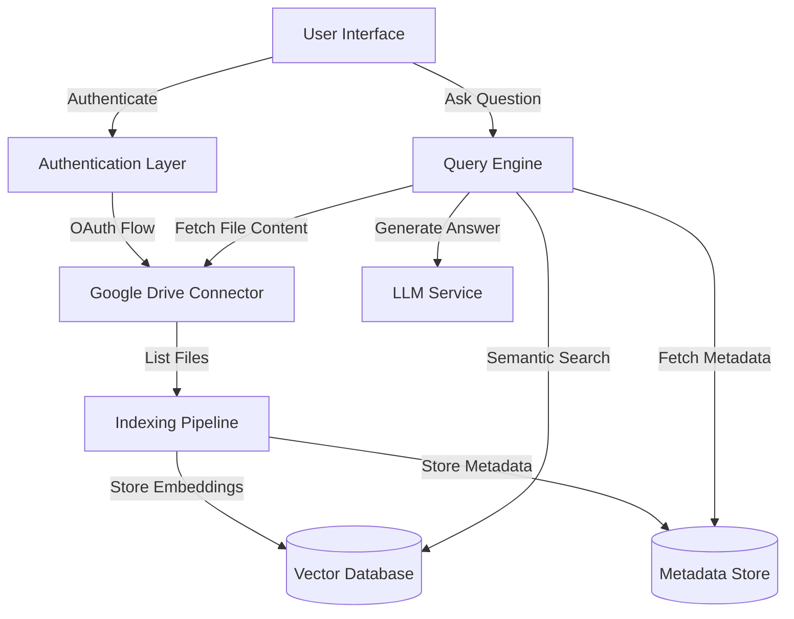
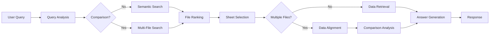
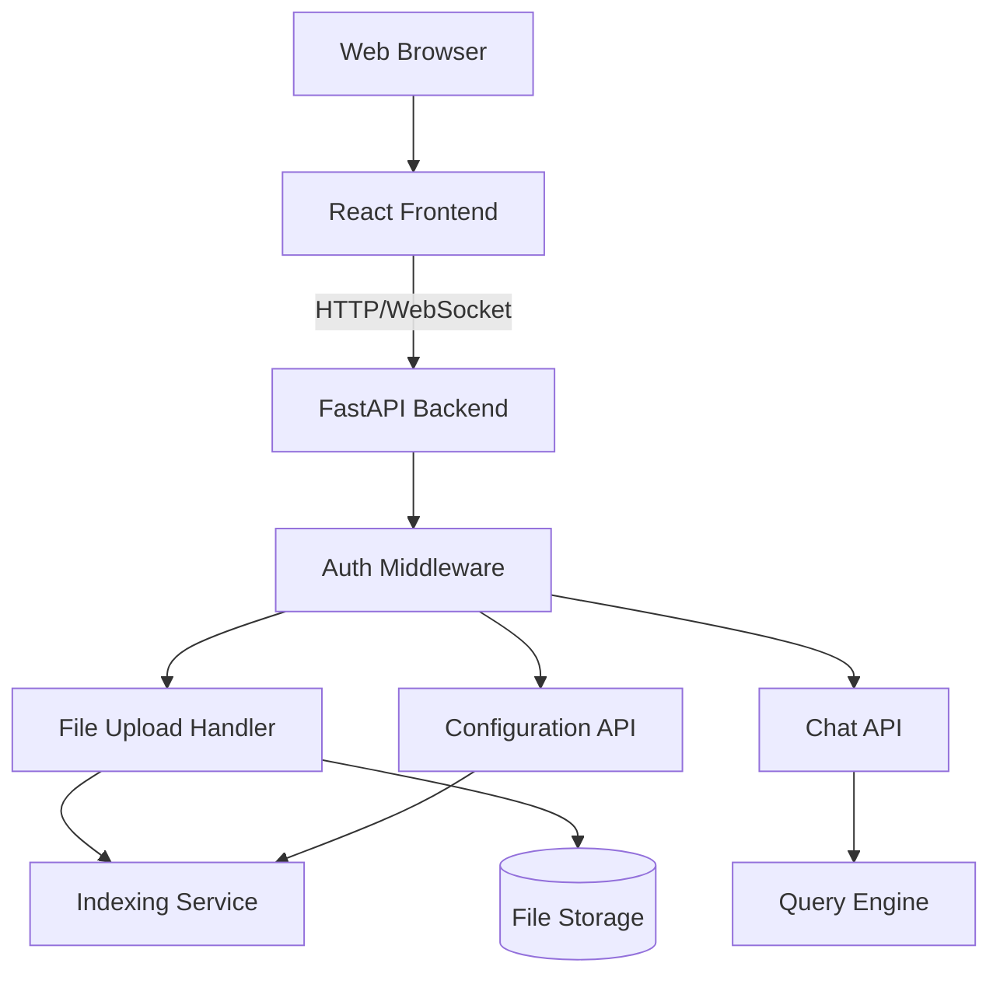
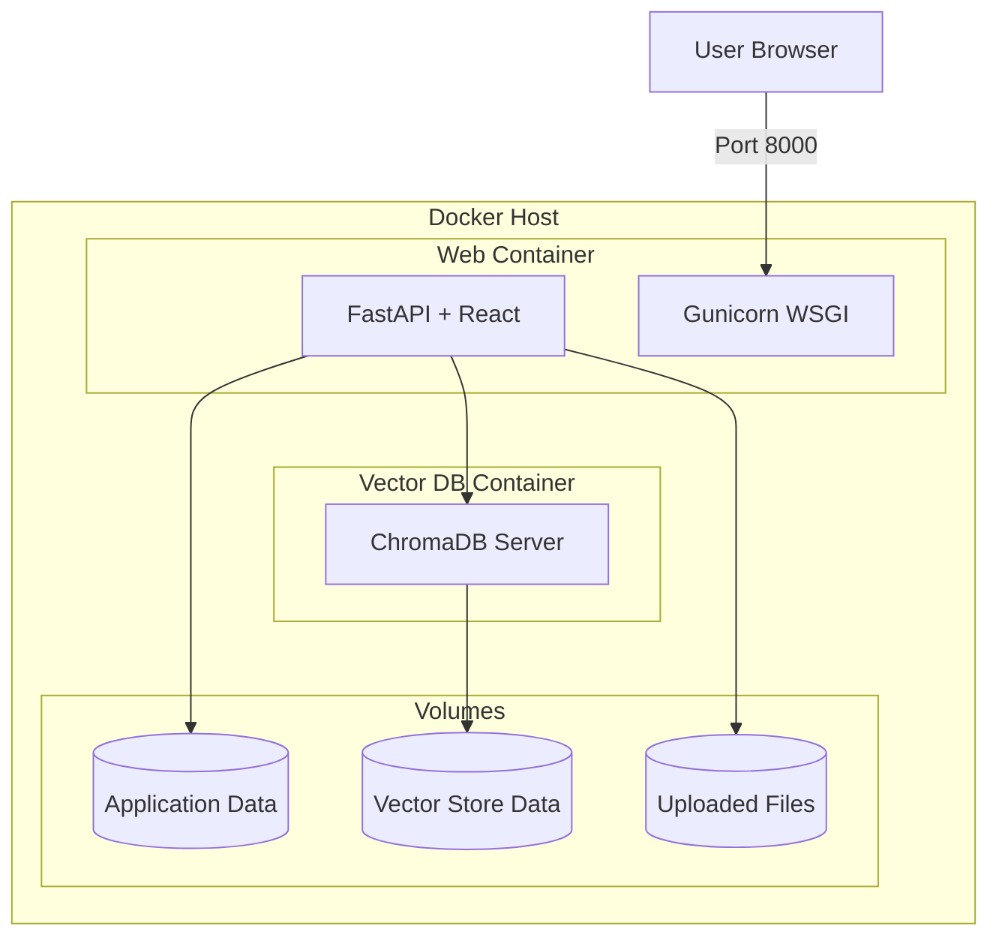

# Design Document: Google Drive Excel RAG System

## Overview

The Google Drive Excel RAG System is a retrieval-augmented generation application that enables users to query data from Excel files stored in Google Drive using natural language. The system consists of three main phases: authentication and connection, indexing and embedding, and query processing and retrieval.

The architecture follows a modular design with clear separation of concerns, allowing for future extensibility to other cloud storage providers and file formats.

## Architecture

### High-Level Architecture



### Technology Stack

- **Backend Framework**: Python with FastAPI for REST API endpoints
- **Google Drive Integration**: Google Drive API v3 with googleapis Python client
- **Excel Processing**: 
  - openpyxl for .xlsx files (supports formula reading and evaluation)
  - xlrd for legacy .xls files
  - Note: Docling is primarily for PDF/document parsing and not needed for Excel files
- **Vector Database**: 
  - MVP: ChromaDB for embedding storage and semantic search
  - Production: OpenSearch (pluggable via abstraction layer)
  - Architecture supports switching between vector stores
- **Metadata Storage**: SQLite for file/sheet metadata and user preferences
- **Embedding Model**: 
  - Pluggable architecture supporting multiple providers
  - Default: OpenAI text-embedding-3-small
  - Alternatives: sentence-transformers, Cohere, Voyage AI
- **LLM**: 
  - Pluggable architecture supporting multiple providers
  - Default: OpenAI GPT-4 or GPT-3.5-turbo
  - Alternatives: Anthropic Claude (Sonnet/Opus), Google Gemini, local models
- **Authentication**: OAuth 2.0 with Google Identity Platform

### System Components

1. **Authentication Layer**: Manages OAuth 2.0 flow and token lifecycle
2. **Google Drive Connector**: Interfaces with Google Drive API for file operations
3. **Indexing Pipeline**: Orchestrates file discovery, content extraction, and embedding generation
4. **Content Extractor**: Parses Excel files and extracts structured data
5. **Vector Store Abstraction**: Interface for pluggable vector database implementations
6. **Embedding Service Abstraction**: Interface for pluggable embedding model providers
7. **LLM Service Abstraction**: Interface for pluggable language model providers
8. **Metadata Store**: Maintains file/sheet metadata and indexing state
9. **Query Engine**: Processes user questions and orchestrates retrieval
10. **File Selector**: Ranks and selects relevant files based on query context
11. **Sheet Selector**: Identifies relevant sheets within selected files
12. **Comparison Engine**: Aligns and compares data across multiple files
13. **Answer Generator**: Formats retrieved data into natural language responses

## Components and Interfaces

### Abstraction Layers for Pluggability

The system uses abstraction layers to enable easy switching between different implementations of vector stores, embedding models, and LLMs. This allows starting with ChromaDB and OpenAI for MVP, then migrating to OpenSearch and Claude for production without changing core business logic.

#### Vector Store Abstraction

**Interface:**
```python
from abc import ABC, abstractmethod
from typing import List, Dict, Any, Optional

class VectorStore(ABC):
    """Abstract base class for vector database implementations"""
    
    @abstractmethod
    def create_collection(self, name: str, dimension: int, metadata_schema: Dict[str, Any]) -> bool:
        """Creates a new collection for storing embeddings"""
        
    @abstractmethod
    def add_embeddings(
        self, 
        collection: str,
        ids: List[str], 
        embeddings: List[List[float]], 
        documents: List[str],
        metadata: List[Dict[str, Any]]
    ) -> bool:
        """Adds embeddings to a collection"""
        
    @abstractmethod
    def search(
        self,
        collection: str,
        query_embedding: List[float],
        top_k: int = 10,
        filters: Optional[Dict[str, Any]] = None
    ) -> List[Dict[str, Any]]:
        """Searches for similar embeddings"""
        
    @abstractmethod
    def delete_by_id(self, collection: str, ids: List[str]) -> bool:
        """Deletes embeddings by ID"""
        
    @abstractmethod
    def update_embeddings(
        self,
        collection: str,
        ids: List[str],
        embeddings: List[List[float]],
        documents: List[str],
        metadata: List[Dict[str, Any]]
    ) -> bool:
        """Updates existing embeddings"""
```

**Implementations:**

```python
class ChromaDBStore(VectorStore):
    """ChromaDB implementation for MVP"""
    
    def __init__(self, persist_directory: str):
        import chromadb
        self.client = chromadb.PersistentClient(path=persist_directory)
        
    def create_collection(self, name: str, dimension: int, metadata_schema: Dict[str, Any]) -> bool:
        self.client.get_or_create_collection(
            name=name,
            metadata={"dimension": dimension, **metadata_schema}
        )
        return True
        
    def add_embeddings(self, collection: str, ids: List[str], embeddings: List[List[float]], 
                      documents: List[str], metadata: List[Dict[str, Any]]) -> bool:
        coll = self.client.get_collection(collection)
        coll.add(ids=ids, embeddings=embeddings, documents=documents, metadatas=metadata)
        return True
        
    def search(self, collection: str, query_embedding: List[float], top_k: int = 10,
              filters: Optional[Dict[str, Any]] = None) -> List[Dict[str, Any]]:
        coll = self.client.get_collection(collection)
        results = coll.query(
            query_embeddings=[query_embedding],
            n_results=top_k,
            where=filters
        )
        return self._format_results(results)
        
    # ... other methods

class OpenSearchStore(VectorStore):
    """OpenSearch implementation for production"""
    
    def __init__(self, host: str, port: int, auth: tuple):
        from opensearchpy import OpenSearch
        self.client = OpenSearch(
            hosts=[{'host': host, 'port': port}],
            http_auth=auth,
            use_ssl=True,
            verify_certs=True
        )
        
    def create_collection(self, name: str, dimension: int, metadata_schema: Dict[str, Any]) -> bool:
        index_body = {
            "mappings": {
                "properties": {
                    "embedding": {
                        "type": "knn_vector",
                        "dimension": dimension,
                        "method": {
                            "name": "hnsw",
                            "space_type": "cosinesimil",
                            "engine": "nmslib"
                        }
                    },
                    "document": {"type": "text"},
                    "metadata": {"type": "object"}
                }
            }
        }
        self.client.indices.create(index=name, body=index_body)
        return True
        
    def add_embeddings(self, collection: str, ids: List[str], embeddings: List[List[float]],
                      documents: List[str], metadata: List[Dict[str, Any]]) -> bool:
        bulk_data = []
        for id, emb, doc, meta in zip(ids, embeddings, documents, metadata):
            bulk_data.append({"index": {"_index": collection, "_id": id}})
            bulk_data.append({"embedding": emb, "document": doc, "metadata": meta})
        self.client.bulk(body=bulk_data)
        return True
        
    def search(self, collection: str, query_embedding: List[float], top_k: int = 10,
              filters: Optional[Dict[str, Any]] = None) -> List[Dict[str, Any]]:
        query = {
            "size": top_k,
            "query": {
                "knn": {
                    "embedding": {
                        "vector": query_embedding,
                        "k": top_k
                    }
                }
            }
        }
        if filters:
            query["query"] = {
                "bool": {
                    "must": [query["query"]],
                    "filter": self._build_filters(filters)
                }
            }
        results = self.client.search(index=collection, body=query)
        return self._format_results(results)
        
    # ... other methods
```

**Factory Pattern:**
```python
class VectorStoreFactory:
    """Factory for creating vector store instances"""
    
    @staticmethod
    def create(store_type: str, config: Dict[str, Any]) -> VectorStore:
        if store_type == "chromadb":
            return ChromaDBStore(persist_directory=config["persist_directory"])
        elif store_type == "opensearch":
            return OpenSearchStore(
                host=config["host"],
                port=config["port"],
                auth=(config["username"], config["password"])
            )
        else:
            raise ValueError(f"Unknown vector store type: {store_type}")
```

#### Embedding Service Abstraction

**Interface:**
```python
class EmbeddingService(ABC):
    """Abstract base class for embedding model providers"""
    
    @abstractmethod
    def get_embedding_dimension(self) -> int:
        """Returns the dimension of embeddings produced by this model"""
        
    @abstractmethod
    def embed_text(self, text: str) -> List[float]:
        """Generates embedding for a single text"""
        
    @abstractmethod
    def embed_batch(self, texts: List[str]) -> List[List[float]]:
        """Generates embeddings for multiple texts (batched for efficiency)"""
        
    @abstractmethod
    def get_model_name(self) -> str:
        """Returns the name/identifier of the embedding model"""
```

**Implementations:**

```python
class OpenAIEmbeddingService(EmbeddingService):
    """OpenAI embedding implementation"""
    
    def __init__(self, api_key: str, model: str = "text-embedding-3-small"):
        from openai import OpenAI
        self.client = OpenAI(api_key=api_key)
        self.model = model
        self._dimension = 1536 if "3-small" in model else 3072
        
    def get_embedding_dimension(self) -> int:
        return self._dimension
        
    def embed_text(self, text: str) -> List[float]:
        response = self.client.embeddings.create(input=text, model=self.model)
        return response.data[0].embedding
        
    def embed_batch(self, texts: List[str]) -> List[List[float]]:
        response = self.client.embeddings.create(input=texts, model=self.model)
        return [item.embedding for item in response.data]
        
    def get_model_name(self) -> str:
        return self.model

class SentenceTransformerService(EmbeddingService):
    """Sentence Transformers (local) implementation"""
    
    def __init__(self, model_name: str = "all-MiniLM-L6-v2"):
        from sentence_transformers import SentenceTransformer
        self.model = SentenceTransformer(model_name)
        self.model_name = model_name
        self._dimension = self.model.get_sentence_embedding_dimension()
        
    def get_embedding_dimension(self) -> int:
        return self._dimension
        
    def embed_text(self, text: str) -> List[float]:
        return self.model.encode(text).tolist()
        
    def embed_batch(self, texts: List[str]) -> List[List[float]]:
        return self.model.encode(texts).tolist()
        
    def get_model_name(self) -> str:
        return self.model_name

class CohereEmbeddingService(EmbeddingService):
    """Cohere embedding implementation"""
    
    def __init__(self, api_key: str, model: str = "embed-english-v3.0"):
        import cohere
        self.client = cohere.Client(api_key)
        self.model = model
        self._dimension = 1024
        
    def get_embedding_dimension(self) -> int:
        return self._dimension
        
    def embed_text(self, text: str) -> List[float]:
        response = self.client.embed(texts=[text], model=self.model)
        return response.embeddings[0]
        
    def embed_batch(self, texts: List[str]) -> List[List[float]]:
        response = self.client.embed(texts=texts, model=self.model)
        return response.embeddings
        
    def get_model_name(self) -> str:
        return self.model
```

**Factory Pattern:**
```python
class EmbeddingServiceFactory:
    """Factory for creating embedding service instances"""
    
    @staticmethod
    def create(provider: str, config: Dict[str, Any]) -> EmbeddingService:
        if provider == "openai":
            return OpenAIEmbeddingService(
                api_key=config["api_key"],
                model=config.get("model", "text-embedding-3-small")
            )
        elif provider == "sentence-transformers":
            return SentenceTransformerService(
                model_name=config.get("model", "all-MiniLM-L6-v2")
            )
        elif provider == "cohere":
            return CohereEmbeddingService(
                api_key=config["api_key"],
                model=config.get("model", "embed-english-v3.0")
            )
        else:
            raise ValueError(f"Unknown embedding provider: {provider}")
```

#### LLM Service Abstraction

**Interface:**
```python
class LLMService(ABC):
    """Abstract base class for LLM providers"""
    
    @abstractmethod
    def generate(
        self,
        prompt: str,
        system_prompt: Optional[str] = None,
        temperature: float = 0.7,
        max_tokens: int = 1000
    ) -> str:
        """Generates text completion for a prompt"""
        
    @abstractmethod
    def generate_structured(
        self,
        prompt: str,
        response_schema: Dict[str, Any],
        system_prompt: Optional[str] = None
    ) -> Dict[str, Any]:
        """Generates structured output (JSON) based on schema"""
        
    @abstractmethod
    def get_model_name(self) -> str:
        """Returns the name/identifier of the LLM"""
```

**Implementations:**

```python
class OpenAILLMService(LLMService):
    """OpenAI LLM implementation"""
    
    def __init__(self, api_key: str, model: str = "gpt-4"):
        from openai import OpenAI
        self.client = OpenAI(api_key=api_key)
        self.model = model
        
    def generate(self, prompt: str, system_prompt: Optional[str] = None,
                temperature: float = 0.7, max_tokens: int = 1000) -> str:
        messages = []
        if system_prompt:
            messages.append({"role": "system", "content": system_prompt})
        messages.append({"role": "user", "content": prompt})
        
        response = self.client.chat.completions.create(
            model=self.model,
            messages=messages,
            temperature=temperature,
            max_tokens=max_tokens
        )
        return response.choices[0].message.content
        
    def generate_structured(self, prompt: str, response_schema: Dict[str, Any],
                          system_prompt: Optional[str] = None) -> Dict[str, Any]:
        import json
        messages = []
        if system_prompt:
            messages.append({"role": "system", "content": system_prompt})
        messages.append({"role": "user", "content": prompt})
        
        response = self.client.chat.completions.create(
            model=self.model,
            messages=messages,
            response_format={"type": "json_object"}
        )
        return json.loads(response.choices[0].message.content)
        
    def get_model_name(self) -> str:
        return self.model

class AnthropicLLMService(LLMService):
    """Anthropic Claude implementation"""
    
    def __init__(self, api_key: str, model: str = "claude-3-sonnet-20240229"):
        import anthropic
        self.client = anthropic.Anthropic(api_key=api_key)
        self.model = model
        
    def generate(self, prompt: str, system_prompt: Optional[str] = None,
                temperature: float = 0.7, max_tokens: int = 1000) -> str:
        response = self.client.messages.create(
            model=self.model,
            max_tokens=max_tokens,
            temperature=temperature,
            system=system_prompt or "",
            messages=[{"role": "user", "content": prompt}]
        )
        return response.content[0].text
        
    def generate_structured(self, prompt: str, response_schema: Dict[str, Any],
                          system_prompt: Optional[str] = None) -> Dict[str, Any]:
        import json
        enhanced_prompt = f"{prompt}\n\nRespond with valid JSON matching this schema: {json.dumps(response_schema)}"
        response_text = self.generate(enhanced_prompt, system_prompt, temperature=0.3)
        return json.loads(response_text)
        
    def get_model_name(self) -> str:
        return self.model

class GeminiLLMService(LLMService):
    """Google Gemini implementation"""
    
    def __init__(self, api_key: str, model: str = "gemini-pro"):
        import google.generativeai as genai
        genai.configure(api_key=api_key)
        self.model = genai.GenerativeModel(model)
        self.model_name = model
        
    def generate(self, prompt: str, system_prompt: Optional[str] = None,
                temperature: float = 0.7, max_tokens: int = 1000) -> str:
        full_prompt = f"{system_prompt}\n\n{prompt}" if system_prompt else prompt
        response = self.model.generate_content(
            full_prompt,
            generation_config={"temperature": temperature, "max_output_tokens": max_tokens}
        )
        return response.text
        
    def generate_structured(self, prompt: str, response_schema: Dict[str, Any],
                          system_prompt: Optional[str] = None) -> Dict[str, Any]:
        import json
        enhanced_prompt = f"{prompt}\n\nRespond with valid JSON only."
        response_text = self.generate(enhanced_prompt, system_prompt, temperature=0.3)
        return json.loads(response_text)
        
    def get_model_name(self) -> str:
        return self.model_name
```

**Factory Pattern:**
```python
class LLMServiceFactory:
    """Factory for creating LLM service instances"""
    
    @staticmethod
    def create(provider: str, config: Dict[str, Any]) -> LLMService:
        if provider == "openai":
            return OpenAILLMService(
                api_key=config["api_key"],
                model=config.get("model", "gpt-4")
            )
        elif provider == "anthropic":
            return AnthropicLLMService(
                api_key=config["api_key"],
                model=config.get("model", "claude-3-sonnet-20240229")
            )
        elif provider == "gemini":
            return GeminiLLMService(
                api_key=config["api_key"],
                model=config.get("model", "gemini-pro")
            )
        else:
            raise ValueError(f"Unknown LLM provider: {provider}")
```

**Configuration Management:**

```python
# config.py
from dataclasses import dataclass
from typing import Dict, Any

@dataclass
class VectorStoreConfig:
    provider: str  # "chromadb" or "opensearch"
    config: Dict[str, Any]

@dataclass
class EmbeddingConfig:
    provider: str  # "openai", "sentence-transformers", "cohere"
    config: Dict[str, Any]

@dataclass
class LLMConfig:
    provider: str  # "openai", "anthropic", "gemini"
    config: Dict[str, Any]

@dataclass
class AppConfig:
    vector_store: VectorStoreConfig
    embedding: EmbeddingConfig
    llm: LLMConfig
    
    @classmethod
    def from_env(cls) -> 'AppConfig':
        import os
        return cls(
            vector_store=VectorStoreConfig(
                provider=os.getenv("VECTOR_STORE_PROVIDER", "chromadb"),
                config={
                    "persist_directory": os.getenv("CHROMA_PERSIST_DIR", "./chroma_db"),
                    "host": os.getenv("OPENSEARCH_HOST"),
                    "port": int(os.getenv("OPENSEARCH_PORT", "9200")),
                    "username": os.getenv("OPENSEARCH_USERNAME"),
                    "password": os.getenv("OPENSEARCH_PASSWORD")
                }
            ),
            embedding=EmbeddingConfig(
                provider=os.getenv("EMBEDDING_PROVIDER", "openai"),
                config={
                    "api_key": os.getenv("EMBEDDING_API_KEY"),
                    "model": os.getenv("EMBEDDING_MODEL")
                }
            ),
            llm=LLMConfig(
                provider=os.getenv("LLM_PROVIDER", "openai"),
                config={
                    "api_key": os.getenv("LLM_API_KEY"),
                    "model": os.getenv("LLM_MODEL")
                }
            )
        )
```

**Usage Example:**

```python
# In application code
config = AppConfig.from_env()

# Create services using factories
vector_store = VectorStoreFactory.create(
    config.vector_store.provider,
    config.vector_store.config
)

embedding_service = EmbeddingServiceFactory.create(
    config.embedding.provider,
    config.embedding.config
)

llm_service = LLMServiceFactory.create(
    config.llm.provider,
    config.llm.config
)

# Use services without knowing the underlying implementation
embeddings = embedding_service.embed_batch(["text1", "text2"])
vector_store.add_embeddings("collection", ids, embeddings, documents, metadata)
answer = llm_service.generate("What is the total?", system_prompt="You are a helpful assistant")
```

**Migration Path:**

To switch from ChromaDB to OpenSearch in production:
1. Update environment variables:
   ```
   VECTOR_STORE_PROVIDER=opensearch
   OPENSEARCH_HOST=your-opensearch-host
   OPENSEARCH_PORT=9200
   OPENSEARCH_USERNAME=admin
   OPENSEARCH_PASSWORD=your-password
   ```
2. Run migration script to copy data from ChromaDB to OpenSearch
3. Restart application - no code changes needed

To switch from OpenAI to Claude:
1. Update environment variables:
   ```
   LLM_PROVIDER=anthropic
   LLM_API_KEY=your-anthropic-key
   LLM_MODEL=claude-3-sonnet-20240229
   ```
2. Restart application - no code changes needed

### 1. Authentication Layer

**Responsibilities:**
- Handle OAuth 2.0 authorization flow with Google
- Store and manage access/refresh tokens securely
- Automatically refresh expired tokens
- Provide authenticated API clients to other components

**Interface:**
```python
class AuthenticationService:
    def initiate_oauth_flow(self) -> str:
        """Returns authorization URL for user to grant permissions"""
        
    def handle_oauth_callback(self, authorization_code: str) -> bool:
        """Exchanges authorization code for tokens"""
        
    def get_authenticated_client(self) -> GoogleDriveClient:
        """Returns authenticated Google Drive client"""
        
    def revoke_access(self) -> bool:
        """Revokes tokens and clears stored credentials"""
        
    def is_authenticated(self) -> bool:
        """Checks if valid credentials exist"""
```

**Design Decisions:**
- Store tokens encrypted using Fernet symmetric encryption
- Use file-based storage for MVP (can migrate to database later)
- Implement automatic token refresh with 5-minute buffer before expiration

### 2. Google Drive Connector

**Responsibilities:**
- List files and folders recursively
- Download file content
- Monitor file changes (additions, modifications, deletions)
- Handle API rate limiting and retries

**Interface:**
```python
class GoogleDriveConnector:
    def list_excel_files(self, folder_id: Optional[str] = None) -> List[FileMetadata]:
        """Recursively lists all Excel files in Drive"""
        
    def download_file(self, file_id: str) -> bytes:
        """Downloads file content as bytes"""
        
    def get_file_metadata(self, file_id: str) -> FileMetadata:
        """Retrieves file metadata including modified time"""
        
    def watch_changes(self, page_token: str) -> ChangeList:
        """Polls for file changes since last check"""
```

**Data Models:**
```python
@dataclass
class FileMetadata:
    file_id: str
    name: str
    path: str
    mime_type: str
    size: int
    modified_time: datetime
    md5_checksum: str
```

**Design Decisions:**
- Use exponential backoff for rate limit handling (start at 1s, max 32s)
- Batch file listing requests (100 files per page)
- Cache file metadata to minimize API calls
- Use MD5 checksums to detect actual content changes

### Formula Handling Deep Dive

Excel formulas are critical for understanding calculated data. The system handles formulas comprehensively:

**Formula Extraction:**
- openpyxl provides `cell.value` (calculated result) and `cell.formula` (formula text)
- Both are stored to support different query types
- Example: Cell B10 contains `=SUM(B2:B9)` with value 1500
  - Stored formula: "=SUM(B2:B9)"
  - Stored value: 1500

**Query Handling Examples:**
1. "What is the total expense?" → Returns calculated value (1500)
2. "How is total expense calculated?" → Returns formula explanation ("Sum of cells B2 to B9")
3. "Show me the expense formula" → Returns formula text ("=SUM(B2:B9)")

**Formula Types Supported:**
- Arithmetic formulas: `=A1+A2`, `=B1*C1`
- Statistical functions: `=SUM()`, `=AVERAGE()`, `=COUNT()`
- Logical functions: `=IF()`, `=AND()`, `=OR()`
- Lookup functions: `=VLOOKUP()`, `=INDEX()`, `=MATCH()`
- Date functions: `=TODAY()`, `=DATE()`, `=DATEDIF()`
- Text functions: `=CONCATENATE()`, `=LEFT()`, `=RIGHT()`
- Cross-sheet references: `=Sheet2!A1`
- Pivot table formulas: `=GETPIVOTDATA()`

**Formula Error Handling:**
- `#DIV/0!`: Division by zero - store error, note in metadata
- `#REF!`: Invalid reference - store error, flag for user attention
- `#VALUE!`: Wrong data type - store error, use alternative data if available
- `#N/A`: Value not available - common in lookups, store as null
- `#NAME?`: Unrecognized function - store formula text, mark as unsupported
- `#NUM!`: Invalid numeric value - store error, note in metadata
- `#NULL!`: Invalid range - store error, note in metadata

**Embedding Strategy for Formulas:**
- Include formula-based cells in embeddings with natural language descriptions
- Example embedding text: "Total Expense (calculated as sum of B2:B9): 1500"
- For complex formulas, generate simplified explanations
- Tag cells with formulas in metadata for special handling

**Why Not Docling:**
- Docling is designed for document parsing (PDFs, Word docs, HTML)
- Excel files have structured data that openpyxl handles natively
- openpyxl provides direct access to formulas, formatting, and cell properties
- No need for OCR or layout analysis that Docling provides
- openpyxl is lightweight and Excel-specific

### Pivot Table Handling

Pivot tables are powerful Excel features that aggregate and summarize data. The system extracts and indexes pivot table information:

**Pivot Table Extraction:**
- openpyxl can access pivot table definitions via `worksheet._pivots`
- Extract pivot table structure: row fields, column fields, data fields, filters
- Capture aggregation types (Sum, Average, Count, etc.)
- Store both the pivot definition and the calculated results
- Link pivot tables to their source data ranges

**Query Handling Examples:**
1. "What's the total sales by region?" → Identifies pivot table with region grouping
2. "Show me the expense breakdown by category" → Finds relevant pivot table
3. "How is this pivot table configured?" → Returns pivot structure and fields

**Embedding Strategy:**
- Generate natural language descriptions of pivot tables
- Example: "Pivot table showing Sum of Sales grouped by Region and Product Category"
- Include pivot field names and aggregation types in embeddings
- Tag sheets with pivot tables for prioritization in relevant queries

**Limitations:**
- Pivot tables must be refreshed in Excel to have current data
- System uses the last calculated pivot values (doesn't recalculate)
- Complex pivot table features (calculated fields, custom sorts) stored as-is

### Chart Handling

Charts visualize data and often represent key insights. The system extracts chart metadata:

**Chart Extraction:**
- openpyxl provides access to chart objects via `worksheet._charts`
- Extract chart type (bar, line, pie, scatter, area, etc.)
- Capture chart title and axis labels
- Identify source data ranges for chart series
- Store series names and data references

**Query Handling Examples:**
1. "What does the sales trend chart show?" → Retrieves chart data and describes trend
2. "Show me the data behind the revenue chart" → Returns source data range
3. "What charts are in the Q1 report?" → Lists all charts with descriptions

**Embedding Strategy:**
- Generate descriptions combining chart type, title, and data context
- Example: "Bar chart titled 'Monthly Revenue' showing revenue by month from Jan to Dec"
- Include chart titles and axis labels in embeddings
- Link charts to their underlying data for detailed queries

**Chart Data Access:**
- Charts don't store data directly, they reference cell ranges
- System retrieves actual data from source ranges
- Can answer questions about chart data by querying source cells
- Handles multiple series in single chart

**Limitations:**
- Chart images not extracted (only metadata and data)
- Complex chart features (trendlines, error bars) noted but not fully parsed
- Dynamic charts with formula-based ranges handled via formula extraction

### Cross-File Comparison

Users often need to compare data across multiple Excel files (e.g., comparing expense reports from different months):

**Comparison Architecture:**
- Query Engine identifies when comparison is requested
- File Selector retrieves multiple relevant files instead of one
- Sheet Selector finds comparable sheets across files
- Comparison Engine aligns data and performs analysis

**Comparison Types Supported:**
1. **Temporal Comparisons**: "Compare expenses between January and February"
   - Identify files by date in name or metadata
   - Align similar sheets and columns
   - Calculate differences and trends

2. **Categorical Comparisons**: "Compare sales across regions"
   - Identify files by region/category in name or path
   - Aggregate data from multiple files
   - Present side-by-side comparison

3. **Structural Comparisons**: "Which expense file has travel costs?"
   - Search across multiple files for specific columns/data
   - Identify presence/absence of data categories
   - Highlight differences in structure

**Implementation Strategy:**
```python
class ComparisonEngine:
    def compare_files(self, file_ids: List[str], comparison_type: str, query: str) -> ComparisonResult:
        """Compares data across multiple files"""
        
    def align_sheets(self, sheets: List[SheetData]) -> AlignedData:
        """Aligns similar sheets from different files"""
        
    def calculate_differences(self, aligned_data: AlignedData) -> Dict[str, Any]:
        """Calculates differences, trends, and aggregates"""
```

**Alignment Strategy:**
- Match sheets by name similarity (fuzzy matching)
- Align columns by header names
- Handle missing columns gracefully
- Identify common rows by key columns (dates, IDs, names)

**Query Examples:**
1. "How did expenses change from Q1 to Q2?"
   - Retrieves Q1 and Q2 expense files
   - Aligns expense categories
   - Calculates differences and percentage changes

2. "Which region had higher sales, North or South?"
   - Retrieves regional sales files
   - Compares total sales figures
   - Provides comparative analysis

3. "Show me all files with marketing expenses over $10,000"
   - Searches across all indexed files
   - Filters by marketing category and amount
   - Returns list of matching files with values

**Embedding Strategy for Comparisons:**
- Store file-level metadata that enables grouping (dates, categories, regions)
- Use metadata filters to narrow comparison candidates
- Generate comparison-specific embeddings highlighting key differences
- Cache common comparison patterns for faster retrieval

**Performance Considerations:**
- Limit comparisons to 5 files maximum for MVP
- Use parallel processing to fetch multiple files
- Cache aligned data for follow-up questions
- Provide progress indicators for multi-file operations

### 3. Content Extractor

**Responsibilities:**
- Parse Excel files and extract structured data
- Identify headers, data types, and cell formatting
- Handle formulas, merged cells, and special formatting
- Extract both formula text and calculated values
- Extract pivot table definitions and aggregated data
- Extract chart metadata and underlying data
- Generate text representations for embedding

**Interface:**
```python
class ContentExtractor:
    def extract_workbook(self, file_content: bytes, file_name: str) -> WorkbookData:
        """Extracts all sheets and metadata from Excel file"""
        
    def extract_sheet(self, sheet: Worksheet) -> SheetData:
        """Extracts structured data from a single sheet"""
        
    def extract_pivot_tables(self, sheet: Worksheet) -> List[PivotTableData]:
        """Extracts pivot table definitions and data"""
        
    def extract_charts(self, sheet: Worksheet) -> List[ChartData]:
        """Extracts chart metadata and source data"""
        
    def generate_embeddings_text(self, sheet_data: SheetData) -> List[str]:
        """Generates text chunks for embedding"""
```

**Data Models:**
```python
@dataclass
class WorkbookData:
    file_id: str
    file_name: str
    sheets: List[SheetData]
    
@dataclass
class SheetData:
    sheet_name: str
    headers: List[str]
    rows: List[Dict[str, Any]]
    data_types: Dict[str, str]
    summary: str  # Natural language description
    pivot_tables: List['PivotTableData']
    charts: List['ChartData']
    has_pivot_tables: bool
    has_charts: bool
    
@dataclass
class CellData:
    value: Any  # The calculated/displayed value
    data_type: str
    formula: Optional[str]  # The formula text if cell contains formula
    formula_error: Optional[str]  # Error type if formula failed (#DIV/0!, etc.)
    format: Optional[str]  # Excel number format (e.g., "$#,##0.00")
    is_formula: bool  # Quick check if cell is formula-based

@dataclass
class PivotTableData:
    name: str
    location: str  # Cell range where pivot table is located
    source_range: str  # Source data range
    row_fields: List[str]
    column_fields: List[str]
    data_fields: List[str]  # Aggregated fields (Sum, Average, etc.)
    filters: Dict[str, Any]
    aggregated_data: Dict[str, Any]  # The actual pivot results
    summary: str  # Natural language description

@dataclass
class ChartData:
    name: str
    chart_type: str  # bar, line, pie, scatter, etc.
    title: Optional[str]
    source_range: str  # Data range used for chart
    series: List[Dict[str, Any]]  # Chart series information
    x_axis_label: Optional[str]
    y_axis_label: Optional[str]
    summary: str  # Natural language description
```

**Design Decisions:**
- Detect headers by analyzing first 5 rows for text-heavy content
- Generate multiple embedding texts per sheet:
  - File name + sheet name + headers
  - Sheet summary with sample data (first 5 rows)
  - Column-wise summaries for numerical data
- Limit processing to first 10,000 rows per sheet for MVP
- Store both raw values and formatted strings

**Formula Handling Strategy:**
- openpyxl provides access to both formula text and calculated values
- Store both formula and result for each formula cell:
  - Formula text (e.g., "=SUM(A1:A10)") for understanding calculations
  - Calculated value for answering queries
- For queries about "how is X calculated", return the formula
- For queries about "what is X", return the calculated value
- Handle formula errors (#DIV/0!, #REF!, etc.) gracefully by storing error type
- For cells referencing other sheets, store the reference chain for context
- Do not attempt to re-evaluate formulas (use Excel's calculated values)

### 4. Indexing Pipeline

**Responsibilities:**
- Orchestrate end-to-end indexing process
- Manage indexing state and progress
- Handle incremental updates
- Generate and store embeddings

**Interface:**
```python
class IndexingPipeline:
    def full_index(self) -> IndexingReport:
        """Performs complete indexing of all files"""
        
    def incremental_index(self) -> IndexingReport:
        """Indexes only new or modified files"""
        
    def index_file(self, file_id: str) -> bool:
        """Indexes a specific file"""
        
    def remove_file(self, file_id: str) -> bool:
        """Removes file from index"""
```

**Data Models:**
```python
@dataclass
class IndexingReport:
    total_files: int
    total_sheets: int
    files_processed: int
    files_failed: int
    duration_seconds: float
    errors: List[str]
```

**Design Decisions:**
- Process files in parallel (max 5 concurrent)
- Store indexing state in SQLite to track processed files
- Generate embeddings in batches of 100 for efficiency
- Skip files that haven't changed (based on MD5 checksum)

### 5. Vector Database (ChromaDB)

**Responsibilities:**
- Store embeddings with metadata
- Perform semantic similarity search
- Support filtering by metadata

**Schema Design:**
```python
# Collection: excel_sheets
{
    "id": "file_id:sheet_name",
    "embedding": [0.1, 0.2, ...],  # 384 or 1536 dimensions
    "metadata": {
        "file_id": str,
        "file_name": str,
        "file_path": str,
        "sheet_name": str,
        "modified_time": str,
        "headers": str,  # JSON string
        "row_count": int,
        "has_dates": bool,
        "has_numbers": bool,
        "has_pivot_tables": bool,
        "has_charts": bool,
        "pivot_count": int,
        "chart_count": int,
        "content_type": str  # "data", "pivot", "chart", "mixed"
    },
    "document": str  # The text that was embedded
}

# Additional embeddings for pivot tables and charts
# Collection: excel_pivots
{
    "id": "file_id:sheet_name:pivot_name",
    "embedding": [0.1, 0.2, ...],
    "metadata": {
        "file_id": str,
        "file_name": str,
        "sheet_name": str,
        "pivot_name": str,
        "row_fields": str,  # JSON string
        "data_fields": str,  # JSON string
    },
    "document": str  # Natural language description of pivot
}

# Collection: excel_charts
{
    "id": "file_id:sheet_name:chart_name",
    "embedding": [0.1, 0.2, ...],
    "metadata": {
        "file_id": str,
        "file_name": str,
        "sheet_name": str,
        "chart_name": str,
        "chart_type": str,
        "title": str,
    },
    "document": str  # Natural language description of chart
}
```

**Design Decisions:**
- Use cosine similarity for semantic search
- Store multiple embeddings per sheet (headers, summary, columns)
- Include rich metadata for filtering and ranking
- Set collection to persist to disk

### 6. Metadata Store (SQLite)

**Responsibilities:**
- Store file and sheet metadata
- Track indexing state
- Store user preferences and query history
- Maintain file selection feedback

**Schema Design:**
```sql
CREATE TABLE files (
    file_id TEXT PRIMARY KEY,
    name TEXT NOT NULL,
    path TEXT NOT NULL,
    size INTEGER,
    modified_time TIMESTAMP,
    md5_checksum TEXT,
    indexed_at TIMESTAMP,
    status TEXT  -- 'indexed', 'failed', 'pending'
);

CREATE TABLE sheets (
    id INTEGER PRIMARY KEY AUTOINCREMENT,
    file_id TEXT,
    sheet_name TEXT,
    row_count INTEGER,
    column_count INTEGER,
    headers TEXT,  -- JSON array
    data_types TEXT,  -- JSON object
    has_pivot_tables BOOLEAN,
    has_charts BOOLEAN,
    pivot_count INTEGER DEFAULT 0,
    chart_count INTEGER DEFAULT 0,
    FOREIGN KEY (file_id) REFERENCES files(file_id)
);

CREATE TABLE pivot_tables (
    id INTEGER PRIMARY KEY AUTOINCREMENT,
    sheet_id INTEGER,
    name TEXT,
    location TEXT,
    source_range TEXT,
    row_fields TEXT,  -- JSON array
    column_fields TEXT,  -- JSON array
    data_fields TEXT,  -- JSON array
    summary TEXT,
    FOREIGN KEY (sheet_id) REFERENCES sheets(id)
);

CREATE TABLE charts (
    id INTEGER PRIMARY KEY AUTOINCREMENT,
    sheet_id INTEGER,
    name TEXT,
    chart_type TEXT,
    title TEXT,
    source_range TEXT,
    summary TEXT,
    FOREIGN KEY (sheet_id) REFERENCES sheets(id)
);

CREATE TABLE user_preferences (
    id INTEGER PRIMARY KEY AUTOINCREMENT,
    query_pattern TEXT,
    selected_file_id TEXT,
    selected_sheet_name TEXT,
    created_at TIMESTAMP
);

CREATE TABLE query_history (
    id INTEGER PRIMARY KEY AUTOINCREMENT,
    query TEXT,
    selected_files TEXT,  -- JSON array
    answer TEXT,
    confidence REAL,
    created_at TIMESTAMP
);
```

### 7. Query Engine

**Responsibilities:**
- Parse and analyze user questions
- Detect comparison requests and multi-file queries
- Orchestrate retrieval pipeline
- Generate natural language answers
- Maintain conversation context

**Interface:**
```python
class QueryEngine:
    def process_query(self, query: str, context: Optional[ConversationContext] = None) -> QueryResult:
        """Processes user query and returns answer"""
        
    def detect_comparison_query(self, query: str) -> bool:
        """Detects if query requires comparing multiple files"""
        
    def ask_clarification(self, query: str) -> List[str]:
        """Generates clarifying questions for ambiguous queries"""
```

**Data Models:**
```python
@dataclass
class QueryResult:
    answer: str
    confidence: float
    sources: List[Source]
    clarification_needed: bool
    clarifying_questions: List[str]
    
@dataclass
class Source:
    file_name: str
    sheet_name: str
    cell_range: str
    data: Any
```

**Query Processing Pipeline:**


**Design Decisions:**
- Use LLM to extract entities, dates, and intent from query
- Detect comparison keywords: "compare", "difference", "vs", "between", "change from"
- Retrieve top 10 candidate sheets from vector DB (or top 5 files for comparisons)
- Apply metadata filters (dates, file names) to narrow results
- Use confidence threshold of 0.7 for automatic selection
- Below threshold, present options to user
- For comparisons, limit to 5 files maximum to maintain performance

### 8. File Selector

**Responsibilities:**
- Rank files based on semantic similarity and metadata
- Parse dates and versions from file names
- Apply user preferences from history
- Handle disambiguation

**Interface:**
```python
class FileSelector:
    def rank_files(self, query: str, candidates: List[FileMetadata]) -> List[RankedFile]:
        """Ranks files by relevance to query"""
        
    def select_file(self, ranked_files: List[RankedFile], threshold: float = 0.9) -> FileSelection:
        """Selects file or requests clarification"""
```

**Ranking Algorithm:**
1. Semantic similarity score (0-1): 50% weight
2. Metadata match score (0-1): 30% weight
   - Date matching (if query contains dates)
   - Path matching (if query mentions folders)
   - Recency (newer files slightly preferred)
3. User preference score (0-1): 20% weight
   - Historical selections for similar queries

**Design Decisions:**
- Extract dates from file names using regex patterns
- Normalize file names for comparison (remove special chars)
- Store user confirmations to improve future selections
- Present top 3 files when confidence < 90%

### 9. Sheet Selector

**Responsibilities:**
- Analyze sheets within selected file
- Match sheet content to query intent
- Handle multi-sheet scenarios

**Interface:**
```python
class SheetSelector:
    def select_sheet(self, file_id: str, query: str) -> SheetSelection:
        """Selects most relevant sheet(s) for query"""
        
    def analyze_sheet_relevance(self, sheet_data: SheetData, query: str) -> float:
        """Calculates relevance score for a sheet"""
```

**Selection Algorithm:**
1. Sheet name similarity to query: 30% weight
2. Header/column name matches: 40% weight
3. Data type alignment: 20% weight
4. Content sample similarity: 10% weight

**Design Decisions:**
- Check all sheets in parallel
- If multiple sheets score > 0.7, examine all
- Use sheet name patterns (e.g., "Summary", "Data", "Q1")
- Consider sheet order (first sheet often most important)

### 10. Comparison Engine

**Responsibilities:**
- Align data from multiple files for comparison
- Calculate differences, trends, and aggregates
- Handle missing data and structural differences
- Generate comparison summaries

**Interface:**
```python
class ComparisonEngine:
    def compare_files(self, file_ids: List[str], query: str) -> ComparisonResult:
        """Compares data across multiple files"""
        
    def align_sheets(self, sheets: List[SheetData]) -> AlignedData:
        """Aligns similar sheets from different files"""
        
    def calculate_differences(self, aligned_data: AlignedData, metric: str) -> Dict[str, Any]:
        """Calculates differences for specific metrics"""
        
    def detect_trends(self, aligned_data: AlignedData, time_field: str) -> Dict[str, Any]:
        """Detects trends across time-series data"""
```

**Alignment Algorithm:**
1. Match sheets by name similarity (Levenshtein distance < 3)
2. Identify common columns by header matching
3. Find key columns (dates, IDs, categories) for row alignment
4. Handle missing columns by noting gaps
5. Normalize data types for comparison

**Comparison Metrics:**
- Absolute difference: value2 - value1
- Percentage change: ((value2 - value1) / value1) * 100
- Trend direction: increasing, decreasing, stable
- Aggregates: sum, average, min, max across files
- Presence/absence: which files contain specific data

**Design Decisions:**
- Limit to 5 files per comparison for performance
- Use fuzzy matching for sheet/column names (threshold: 0.8)
- Cache aligned data for follow-up questions
- Provide detailed breakdown of what was compared
- Handle temporal data specially (sort by date)
- Flag structural differences prominently

### 11. Answer Generator

**Responsibilities:**
- Format retrieved data into natural language
- Cite sources accurately
- Handle different data types and formats
- Provide confidence indicators

**Interface:**
```python
class AnswerGenerator:
    def generate_answer(self, query: str, retrieved_data: List[RetrievedData]) -> QueryResult:
        """Generates natural language answer from retrieved data"""
        
    def format_data(self, data: Any, data_type: str) -> str:
        """Formats data according to type and original formatting"""
```

**Prompt Template:**
```
You are answering a question based on data from Excel files.

Question: {query}

Retrieved Data:
File: {file_name}
Sheet: {sheet_name}
Data: {formatted_data}

Instructions:
1. Answer the question directly and concisely
2. Use the exact numbers/values from the data
3. Preserve formatting (currency, dates, percentages)
4. If data is incomplete, acknowledge limitations
5. Cite the source (file, sheet, cell range)

Answer:
```

**Design Decisions:**
- Use structured prompts with clear instructions
- Include cell ranges in citations for verification
- Format numbers with original Excel formatting when available
- Limit answer length to 200 words for conciseness
- Include confidence score based on data completeness

## Data Models

### Core Domain Models

```python
from dataclasses import dataclass
from datetime import datetime
from typing import List, Dict, Any, Optional
from enum import Enum

class FileStatus(Enum):
    PENDING = "pending"
    INDEXED = "indexed"
    FAILED = "failed"
    DELETED = "deleted"

class DataType(Enum):
    TEXT = "text"
    NUMBER = "number"
    DATE = "date"
    BOOLEAN = "boolean"
    FORMULA = "formula"
    EMPTY = "empty"

@dataclass
class FileMetadata:
    file_id: str
    name: str
    path: str
    mime_type: str
    size: int
    modified_time: datetime
    md5_checksum: str
    status: FileStatus
    indexed_at: Optional[datetime] = None

@dataclass
class SheetData:
    sheet_name: str
    headers: List[str]
    rows: List[Dict[str, Any]]
    data_types: Dict[str, DataType]
    row_count: int
    column_count: int
    summary: str
    has_dates: bool
    has_numbers: bool

@dataclass
class WorkbookData:
    file_id: str
    file_name: str
    file_path: str
    sheets: List[SheetData]
    modified_time: datetime
    has_pivot_tables: bool
    has_charts: bool
    total_pivot_tables: int
    total_charts: int

@dataclass
class RankedFile:
    file_metadata: FileMetadata
    relevance_score: float
    semantic_score: float
    metadata_score: float
    preference_score: float

@dataclass
class SheetSelection:
    sheet_name: str
    relevance_score: float
    requires_clarification: bool

@dataclass
class RetrievedData:
    file_name: str
    file_path: str
    sheet_name: str
    cell_range: str
    data: Any
    data_type: DataType
    original_format: Optional[str]

@dataclass
class QueryResult:
    answer: str
    confidence: float
    sources: List[RetrievedData]
    clarification_needed: bool
    clarifying_questions: List[str]
    processing_time_ms: int
    is_comparison: bool
    comparison_summary: Optional[Dict[str, Any]]

@dataclass
class ComparisonResult:
    files_compared: List[str]
    aligned_data: Dict[str, Any]
    differences: Dict[str, Any]
    summary: str
    visualization_data: Optional[Dict[str, Any]]

@dataclass
class AlignedData:
    common_columns: List[str]
    file_data: Dict[str, List[Dict[str, Any]]]  # file_id -> rows
    missing_columns: Dict[str, List[str]]  # file_id -> missing column names

@dataclass
class ConversationContext:
    previous_queries: List[str]
    selected_files: List[str]
    session_id: str
```

## Error Handling

### Error Categories and Strategies

1. **Authentication Errors**
   - Token expired: Automatic refresh attempt
   - Refresh failed: Prompt user to re-authenticate
   - Invalid credentials: Clear stored tokens and restart OAuth flow

2. **Google Drive API Errors**
   - Rate limit (403): Exponential backoff with max 5 retries
   - File not found (404): Remove from index and log
   - Permission denied (403): Skip file and notify user
   - Network errors: Retry with exponential backoff

3. **File Processing Errors**
   - Corrupted Excel file: Log error, skip file, continue indexing
   - Unsupported format: Log warning, skip file
   - Memory errors (large files): Process in chunks or skip with warning
   - Formula evaluation errors: Store both formula text and error indicator, continue processing
   - Circular reference errors: Store formula with warning flag, use last calculated value
   - External reference errors: Store formula text, mark as unresolvable

4. **Database Errors**
   - Connection errors: Retry with backoff
   - Constraint violations: Log and skip operation
   - Disk full: Alert user and pause indexing

5. **LLM/Embedding Errors**
   - API timeout: Retry with longer timeout
   - Rate limit: Queue requests and process with delay
   - Invalid response: Return error message to user

### Error Response Format

```python
@dataclass
class ErrorResponse:
    error_code: str
    message: str
    user_message: str
    retry_possible: bool
    suggested_action: Optional[str]
```

### Logging Strategy

- Use structured logging (JSON format)
- Log levels: DEBUG, INFO, WARNING, ERROR, CRITICAL
- Include correlation IDs for request tracing
- Separate logs for: API calls, indexing, queries, errors
- Rotate logs daily, keep 30 days

## Testing Strategy

### Unit Testing

**Components to Test:**
- Content Extractor: Excel parsing, header detection, data type inference
- File Selector: Ranking algorithm, date parsing, preference matching
- Sheet Selector: Relevance scoring, multi-sheet handling
- Answer Generator: Data formatting, citation generation

**Testing Approach:**
- Use pytest framework
- Create fixture Excel files with known content
- Mock external dependencies (Google Drive API, LLM API)
- Aim for 80% code coverage

### Integration Testing

**Scenarios to Test:**
- End-to-end indexing pipeline with sample files
- Query processing with mocked vector DB
- OAuth flow with test credentials
- Error handling and retry logic

**Testing Approach:**
- Use test Google Drive account with sample files
- Docker container for ChromaDB
- SQLite in-memory database for metadata
- Mock LLM responses for deterministic tests

### End-to-End Testing

**User Scenarios:**
1. First-time user: Authentication → Indexing → Query
2. Returning user: Query with existing index
3. File disambiguation: Query with multiple similar files
4. Follow-up questions: Conversation context handling
5. Error recovery: Handle expired tokens, corrupted files

**Testing Approach:**
- Manual testing with real Google Drive account
- Automated tests using Playwright for UI interactions
- Performance testing with 100+ files

### Performance Testing

**Metrics to Measure:**
- Indexing throughput (files per minute)
- Query response time (target: < 10 seconds)
- Memory usage during indexing
- Vector DB query latency

**Testing Approach:**
- Generate synthetic Excel files (various sizes)
- Measure with 10, 50, 100, 500 files
- Profile code to identify bottlenecks
- Load test API endpoints

## Security Considerations

1. **Credential Storage**
   - Encrypt OAuth tokens using Fernet
   - Store encryption key in environment variable
   - Never log tokens or sensitive data

2. **API Security**
   - Use HTTPS for all API communications
   - Implement rate limiting on endpoints
   - Validate all user inputs
   - Sanitize file names and paths

3. **Data Privacy**
   - Store only necessary metadata
   - Provide option to exclude sensitive files/folders
   - Allow users to delete all indexed data
   - Don't send raw file content to LLM (only relevant excerpts)

4. **Access Control**
   - Respect Google Drive permissions
   - Single-user system for MVP (no multi-tenancy)
   - Session management for web interface

## Performance Optimizations

1. **Indexing Optimizations**
   - Parallel file processing (5 concurrent workers)
   - Batch embedding generation (100 texts per batch)
   - Incremental indexing (only changed files)
   - Skip unchanged files using MD5 checksums

2. **Query Optimizations**
   - Cache frequently accessed file metadata
   - Limit vector search to top 10 results
   - Use metadata filters before semantic search
   - Implement query result caching (5-minute TTL)

3. **Memory Management**
   - Stream large Excel files instead of loading entirely
   - Limit row processing to 10,000 rows per sheet
   - Clear processed data from memory immediately
   - Use generators for large result sets

4. **Database Optimizations**
   - Index frequently queried columns (file_id, modified_time)
   - Use connection pooling
   - Batch insert operations during indexing
   - Vacuum SQLite database periodically

## Deployment Considerations

### MVP Deployment (Local)

- Python virtual environment
- Local SQLite database
- Local ChromaDB persistence
- Environment variables for API keys
- Command-line interface

### Future Production Deployment

- Containerized with Docker
- PostgreSQL for metadata
- Hosted vector database (Pinecone/Weaviate)
- Web interface with FastAPI
- Background workers for indexing
- Cloud deployment (AWS/GCP/Azure)

## Future Enhancements (Out of Scope for MVP)

1. **Additional File Formats**: CSV, Google Sheets native format, PDF tables
2. **SharePoint Integration**: As mentioned in original requirements
3. **Multi-user Support**: User accounts and permissions
4. **Advanced Analytics**: Statistical analysis, correlation detection
5. **Real-time Sync**: Webhook-based file change detection instead of polling
6. **Custom Embeddings**: Fine-tuned models for domain-specific data
7. **Query Suggestions**: Auto-complete and suggested questions based on indexed data
8. **Data Visualization**: Generate new charts from query results
9. **Export Functionality**: Export answers with source data to Excel/PDF
10. **Audit Trail**: Track all queries and data access for compliance
11. **Advanced Pivot Features**: Support for calculated fields, custom sorts, grouping
12. **Chart Image Analysis**: OCR and analysis of chart images for additional context
13. **Cross-workbook Formulas**: Handle formulas that reference external files
14. **Macro Analysis**: Extract and document VBA macros (read-only)
15. **Collaborative Features**: Share queries and results with team members


## Web Application Design

### Overview

The web application provides a user-friendly interface for configuring data sources, uploading files, and interacting with the RAG system through a chat interface. Built with modern web technologies, it offers a responsive and intuitive experience.

### Web Application Architecture



### Technology Stack

- **Frontend Framework**: React with TypeScript
- **UI Components**: Material-UI or Tailwind CSS
- **State Management**: React Context API or Redux
- **HTTP Client**: Axios
- **Real-time Communication**: WebSocket for chat streaming
- **Backend**: FastAPI (already implemented)
- **Session Management**: JWT tokens or server-side sessions
- **File Upload**: Multipart form data with progress tracking

### Web Application Components

#### 1. Authentication Module

**Login Page**
- Simple form with username and password fields
- Hardcoded credentials: username="girish", password="Girish@123"
- Session token generation on successful login
- Error handling for invalid credentials

**Session Management**
- JWT token stored in localStorage or httpOnly cookie
- Token validation on each API request
- Automatic logout on token expiration
- Protected routes requiring authentication

#### 2. Configuration Page

**Google Drive Connection**
- Button to initiate OAuth flow
- Display connection status (Connected/Disconnected)
- Show connected account email
- Button to disconnect and revoke access
- List of accessible folders

**File Upload Interface**
- Drag-and-drop zone for Excel files
- File browser button
- Support for .xlsx, .xls, .xlsm formats
- Multiple file upload support
- Upload progress bar for each file
- File size validation (max 100MB per file)

**Indexed Files List**
- Table showing all indexed files
- Columns: File Name, Source (GDrive/Upload), Last Indexed, Status
- Actions: Re-index, Delete
- Search and filter capabilities
- Pagination for large file lists

#### 3. Chat Interface

**Chat Layout**
- Left sidebar: Conversation history
- Main area: Active chat messages
- Bottom: Query input field with send button

**Message Display**
- User messages aligned right
- System responses aligned left
- Timestamp for each message
- Source citations as expandable sections
- Confidence score badges
- Loading indicator during processing

**Query Input**
- Multi-line text input
- Send button and keyboard shortcut (Enter)
- Character count indicator
- Suggested queries based on indexed data

**Conversation Management**
- New conversation button
- Conversation list with timestamps
- Delete conversation option
- Export conversation as text/PDF

#### 4. Dashboard (Optional)

**Statistics Overview**
- Total files indexed
- Total sheets processed
- Storage usage
- Recent queries count
- System health status

**Quick Actions**
- Start new chat
- Upload files
- Trigger full re-indexing
- View system logs

### API Endpoints for Web Application

#### Authentication Endpoints

```
POST /api/auth/login
- Body: { username, password }
- Response: { token, user_info }

POST /api/auth/logout
- Headers: Authorization token
- Response: { success }

GET /api/auth/status
- Headers: Authorization token
- Response: { authenticated, user_info }
```

#### Configuration Endpoints

```
POST /api/config/gdrive/connect
- Initiates OAuth flow
- Response: { auth_url }

GET /api/config/gdrive/callback
- OAuth callback handler
- Response: { success, account_email }

DELETE /api/config/gdrive/disconnect
- Revokes Google Drive access
- Response: { success }

GET /api/config/gdrive/status
- Response: { connected, account_email, folders }
```

#### File Management Endpoints

```
POST /api/files/upload
- Body: multipart/form-data with file(s)
- Response: { file_ids, indexing_status }

GET /api/files/list
- Query params: page, limit, filter
- Response: { files[], total, page_info }

DELETE /api/files/{file_id}
- Response: { success }

POST /api/files/{file_id}/reindex
- Response: { indexing_job_id }

GET /api/files/indexing-status
- Response: { active_jobs[], completed[], failed[] }
```

#### Chat Endpoints

```
POST /api/chat/query
- Body: { query, session_id }
- Response: { answer, sources, confidence, session_id }

GET /api/chat/sessions
- Response: { sessions[] }

POST /api/chat/sessions
- Response: { session_id }

DELETE /api/chat/sessions/{session_id}
- Response: { success }

GET /api/chat/sessions/{session_id}/history
- Response: { messages[] }
```

### Frontend Components Structure

```
src/
├── components/
│   ├── auth/
│   │   ├── LoginForm.tsx
│   │   └── ProtectedRoute.tsx
│   ├── config/
│   │   ├── GDriveConnection.tsx
│   │   ├── FileUpload.tsx
│   │   └── IndexedFilesList.tsx
│   ├── chat/
│   │   ├── ChatInterface.tsx
│   │   ├── MessageList.tsx
│   │   ├── MessageItem.tsx
│   │   ├── QueryInput.tsx
│   │   └── ConversationSidebar.tsx
│   ├── common/
│   │   ├── Header.tsx
│   │   ├── Sidebar.tsx
│   │   └── LoadingSpinner.tsx
│   └── dashboard/
│       └── Dashboard.tsx
├── pages/
│   ├── LoginPage.tsx
│   ├── ConfigPage.tsx
│   ├── ChatPage.tsx
│   └── DashboardPage.tsx
├── services/
│   ├── authService.ts
│   ├── fileService.ts
│   └── chatService.ts
├── hooks/
│   ├── useAuth.ts
│   └── useChat.ts
├── utils/
│   ├── api.ts
│   └── constants.ts
└── App.tsx
```

### Security Considerations

1. **Authentication**
   - Hardcoded credentials for local deployment only
   - Session tokens with expiration
   - HTTPS required for production
   - CSRF protection on state-changing endpoints

2. **File Upload Security**
   - File type validation (whitelist .xlsx, .xls, .xlsm)
   - File size limits
   - Virus scanning (optional for production)
   - Sanitize file names

3. **API Security**
   - Rate limiting on all endpoints
   - Input validation and sanitization
   - SQL injection prevention
   - XSS protection

## Docker Containerization Design

### Overview

The application is containerized using Docker to ensure consistent deployment across different environments. Docker Compose orchestrates multiple services including the web application, vector database, and supporting services.

### Container Architecture



### Dockerfile Design

**Multi-stage Build**

```dockerfile
# Stage 1: Build frontend
FROM node:18-alpine AS frontend-builder
WORKDIR /app/frontend
COPY frontend/package*.json ./
RUN npm ci
COPY frontend/ ./
RUN npm run build

# Stage 2: Python dependencies
FROM python:3.10-slim AS backend-builder
WORKDIR /app
COPY requirements.txt requirements-language.txt ./
RUN pip install --no-cache-dir -r requirements.txt -r requirements-language.txt

# Stage 3: Final image
FROM python:3.10-slim
WORKDIR /app

# Install system dependencies
RUN apt-get update && apt-get install -y \
    curl \
    && rm -rf /var/lib/apt/lists/*

# Copy Python dependencies
COPY --from=backend-builder /usr/local/lib/python3.10/site-packages /usr/local/lib/python3.10/site-packages

# Copy application code
COPY src/ ./src/
COPY scripts/ ./scripts/
COPY --from=frontend-builder /app/frontend/build ./frontend/build

# Create necessary directories
RUN mkdir -p /app/data /app/uploads /app/logs

# Set environment variables
ENV PYTHONUNBUFFERED=1
ENV PORT=8000

# Expose port
EXPOSE 8000

# Health check
HEALTHCHECK --interval=30s --timeout=10s --start-period=40s --retries=3 \
    CMD curl -f http://localhost:8000/health || exit 1

# Run application
CMD ["gunicorn", "src.main:app", "--workers", "4", "--worker-class", "uvicorn.workers.UvicornWorker", "--bind", "0.0.0.0:8000"]
```

### Docker Compose Configuration

**docker-compose.yml**

```yaml
version: '3.8'

services:
  web:
    build:
      context: .
      dockerfile: Dockerfile
    container_name: excel-rag-web
    ports:
      - "8000:8000"
    environment:
      - ENV=production
      - VECTOR_STORE_PROVIDER=chromadb
      - CHROMADB_HOST=chromadb
      - CHROMADB_PORT=8001
      - DATABASE_PATH=/app/data/metadata.db
      - UPLOAD_DIR=/app/uploads
      - LOG_LEVEL=INFO
      # API Keys (set in .env file)
      - OPENAI_API_KEY=${OPENAI_API_KEY}
      - GOOGLE_CLIENT_ID=${GOOGLE_CLIENT_ID}
      - GOOGLE_CLIENT_SECRET=${GOOGLE_CLIENT_SECRET}
    volumes:
      - app-data:/app/data
      - uploads:/app/uploads
      - logs:/app/logs
    depends_on:
      chromadb:
        condition: service_healthy
    networks:
      - excel-rag-network
    restart: unless-stopped

  chromadb:
    image: chromadb/chroma:latest
    container_name: excel-rag-chromadb
    ports:
      - "8001:8000"
    environment:
      - IS_PERSISTENT=TRUE
      - PERSIST_DIRECTORY=/chroma/data
    volumes:
      - chroma-data:/chroma/data
    networks:
      - excel-rag-network
    healthcheck:
      test: ["CMD", "curl", "-f", "http://localhost:8000/api/v1/heartbeat"]
      interval: 30s
      timeout: 10s
      retries: 3
      start_period: 20s
    restart: unless-stopped

volumes:
  app-data:
    driver: local
  uploads:
    driver: local
  logs:
    driver: local
  chroma-data:
    driver: local

networks:
  excel-rag-network:
    driver: bridge
```

### Environment Configuration

**.env.example**

```bash
# Application Settings
ENV=production
PORT=8000
LOG_LEVEL=INFO

# Authentication (Local Deployment)
ADMIN_USERNAME=girish
ADMIN_PASSWORD=Girish@123
JWT_SECRET_KEY=your-secret-key-here

# Google Drive API
GOOGLE_CLIENT_ID=your-client-id
GOOGLE_CLIENT_SECRET=your-client-secret
GOOGLE_REDIRECT_URI=http://localhost:8000/api/auth/google/callback

# OpenAI API
OPENAI_API_KEY=your-openai-api-key
OPENAI_MODEL=gpt-4
OPENAI_EMBEDDING_MODEL=text-embedding-3-small

# Vector Store
VECTOR_STORE_PROVIDER=chromadb
CHROMADB_HOST=chromadb
CHROMADB_PORT=8001

# Database
DATABASE_PATH=/app/data/metadata.db

# File Upload
UPLOAD_DIR=/app/uploads
MAX_UPLOAD_SIZE_MB=100

# Language Processing
ENABLE_THAI_SUPPORT=true
```

### Deployment Instructions

**Local Development**

```bash
# 1. Clone repository
git clone <repository-url>
cd excel-rag-system

# 2. Create .env file
cp .env.example .env
# Edit .env with your API keys

# 3. Build and start services
docker-compose up --build

# 4. Access application
# Web UI: http://localhost:8000
# ChromaDB: http://localhost:8001
```

**Production Deployment**

```bash
# 1. Set production environment variables
export ENV=production
export OPENAI_API_KEY=<your-key>
export GOOGLE_CLIENT_ID=<your-id>
export GOOGLE_CLIENT_SECRET=<your-secret>

# 2. Build production image
docker-compose -f docker-compose.prod.yml build

# 3. Start services
docker-compose -f docker-compose.prod.yml up -d

# 4. Check logs
docker-compose logs -f web

# 5. Monitor health
docker-compose ps
```

### Container Management

**Useful Commands**

```bash
# Start services
docker-compose up -d

# Stop services
docker-compose down

# View logs
docker-compose logs -f web
docker-compose logs -f chromadb

# Restart specific service
docker-compose restart web

# Execute command in container
docker-compose exec web python src/cli.py index status

# Backup data volumes
docker run --rm -v excel-rag_app-data:/data -v $(pwd):/backup alpine tar czf /backup/app-data-backup.tar.gz -C /data .

# Restore data volumes
docker run --rm -v excel-rag_app-data:/data -v $(pwd):/backup alpine tar xzf /backup/app-data-backup.tar.gz -C /data
```

### Monitoring and Maintenance

**Health Checks**

- Web application: `http://localhost:8000/health`
- ChromaDB: `http://localhost:8001/api/v1/heartbeat`
- Container status: `docker-compose ps`

**Log Management**

- Application logs: `/app/logs/` (mounted volume)
- Container logs: `docker-compose logs`
- Log rotation: Configured in logging_config.py

**Data Persistence**

- Metadata database: `app-data` volume
- Vector embeddings: `chroma-data` volume
- Uploaded files: `uploads` volume
- Application logs: `logs` volume

**Backup Strategy**

1. Regular volume backups (daily recommended)
2. Export metadata database
3. Backup uploaded files
4. Store .env configuration securely

### Scaling Considerations

**Horizontal Scaling**

```yaml
# docker-compose.scale.yml
services:
  web:
    deploy:
      replicas: 3
    
  nginx:
    image: nginx:alpine
    ports:
      - "80:80"
    volumes:
      - ./nginx.conf:/etc/nginx/nginx.conf
    depends_on:
      - web
```

**Resource Limits**

```yaml
services:
  web:
    deploy:
      resources:
        limits:
          cpus: '2'
          memory: 4G
        reservations:
          cpus: '1'
          memory: 2G
```

### Security Hardening

1. **Container Security**
   - Run as non-root user
   - Read-only root filesystem where possible
   - Drop unnecessary capabilities
   - Use security scanning (Trivy, Snyk)

2. **Network Security**
   - Internal network for service communication
   - Expose only necessary ports
   - Use secrets management for sensitive data
   - Enable TLS for production

3. **Image Security**
   - Use official base images
   - Regular security updates
   - Minimal image size
   - Multi-stage builds to reduce attack surface
